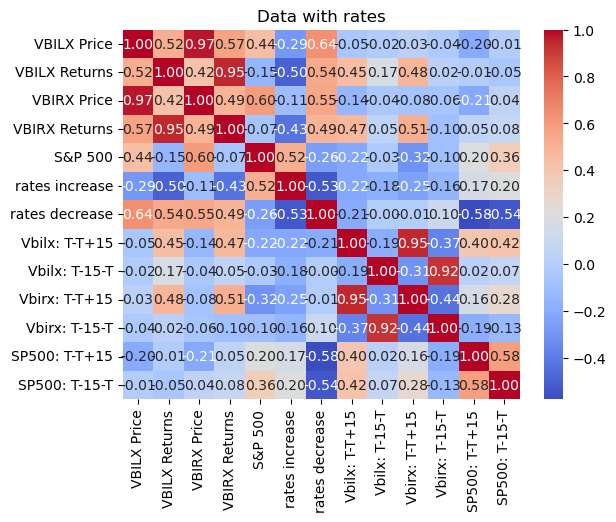

# FINAL PROJECT


```python
import pandas as pd
import numpy as np
import seaborn as sns
import matplotlib.pyplot as plt
from tqdm import tqdm
```


```python
# Load clean data
rates = pd.read_csv('inputs/Clean_Data/Clean_Rates.csv')
sp500_ret = pd.read_csv('inputs/Clean_Data/Clean_sp500_ret.csv')
stock_tv = pd.read_csv('inputs/Clean_Data/Clean_stock_tv.csv')
Vbilx = pd.read_csv('inputs/Clean_Data/Clean_Vbilx.csv')
Vbirx= pd.read_csv('inputs/Clean_Data/Clean_Vbirx.csv')
```


```python
sp500_ret = sp500_ret.rename(columns = {'date': 'Date'})
```


```python
Vbirx
```


<div>
<style scoped>
    .dataframe tbody tr th:only-of-type {
        vertical-align: middle;
    }

    .dataframe tbody tr th {
        vertical-align: top;
    }

    .dataframe thead th {
        text-align: right;
    }
</style>
<table border="1" class="dataframe">
  <thead>
    <tr style="text-align: right;">
      <th></th>
      <th>Daily Returns</th>
      <th>Daily Price</th>
      <th>Date</th>
    </tr>
  </thead>
  <tbody>
    <tr>
      <th>0</th>
      <td>0.000000</td>
      <td>9.148485</td>
      <td>2015-01-02</td>
    </tr>
    <tr>
      <th>1</th>
      <td>0.000954</td>
      <td>9.157212</td>
      <td>2015-01-05</td>
    </tr>
    <tr>
      <th>2</th>
      <td>0.000952</td>
      <td>9.165927</td>
      <td>2015-01-06</td>
    </tr>
    <tr>
      <th>3</th>
      <td>0.000951</td>
      <td>9.174645</td>
      <td>2015-01-07</td>
    </tr>
    <tr>
      <th>4</th>
      <td>-0.000950</td>
      <td>9.165927</td>
      <td>2015-01-08</td>
    </tr>
    <tr>
      <th>...</th>
      <td>...</td>
      <td>...</td>
      <td>...</td>
    </tr>
    <tr>
      <th>2086</th>
      <td>0.000000</td>
      <td>9.990000</td>
      <td>2023-04-18</td>
    </tr>
    <tr>
      <th>2087</th>
      <td>-0.001001</td>
      <td>9.980000</td>
      <td>2023-04-19</td>
    </tr>
    <tr>
      <th>2088</th>
      <td>0.002004</td>
      <td>10.000000</td>
      <td>2023-04-20</td>
    </tr>
    <tr>
      <th>2089</th>
      <td>0.000000</td>
      <td>10.000000</td>
      <td>2023-04-21</td>
    </tr>
    <tr>
      <th>2090</th>
      <td>0.001000</td>
      <td>10.010000</td>
      <td>2023-04-24</td>
    </tr>
  </tbody>
</table>
<p>2091 rows × 3 columns</p>
</div>


```python
Vbilx
```


<div>
<style scoped>
    .dataframe tbody tr th:only-of-type {
        vertical-align: middle;
    }

    .dataframe tbody tr th {
        vertical-align: top;
    }

    .dataframe thead th {
        text-align: right;
    }
</style>
<table border="1" class="dataframe">
  <thead>
    <tr style="text-align: right;">
      <th></th>
      <th>Daily Returns</th>
      <th>Daily Price</th>
      <th>Date</th>
    </tr>
  </thead>
  <tbody>
    <tr>
      <th>0</th>
      <td>0.004348</td>
      <td>9.135239</td>
      <td>2015-01-05</td>
    </tr>
    <tr>
      <th>1</th>
      <td>0.004330</td>
      <td>9.174790</td>
      <td>2015-01-06</td>
    </tr>
    <tr>
      <th>2</th>
      <td>0.000000</td>
      <td>9.174790</td>
      <td>2015-01-07</td>
    </tr>
    <tr>
      <th>3</th>
      <td>-0.002586</td>
      <td>9.151061</td>
      <td>2015-01-08</td>
    </tr>
    <tr>
      <th>4</th>
      <td>0.003457</td>
      <td>9.182695</td>
      <td>2015-01-09</td>
    </tr>
    <tr>
      <th>...</th>
      <td>...</td>
      <td>...</td>
      <td>...</td>
    </tr>
    <tr>
      <th>2085</th>
      <td>0.001938</td>
      <td>10.340000</td>
      <td>2023-04-18</td>
    </tr>
    <tr>
      <th>2086</th>
      <td>-0.001934</td>
      <td>10.320000</td>
      <td>2023-04-19</td>
    </tr>
    <tr>
      <th>2087</th>
      <td>0.003876</td>
      <td>10.360000</td>
      <td>2023-04-20</td>
    </tr>
    <tr>
      <th>2088</th>
      <td>-0.001930</td>
      <td>10.340000</td>
      <td>2023-04-21</td>
    </tr>
    <tr>
      <th>2089</th>
      <td>0.003868</td>
      <td>10.380000</td>
      <td>2023-04-24</td>
    </tr>
  </tbody>
</table>
<p>2090 rows × 3 columns</p>
</div>


```python
sp500_ret
```


<div>
<style scoped>
    .dataframe tbody tr th:only-of-type {
        vertical-align: middle;
    }

    .dataframe tbody tr th {
        vertical-align: top;
    }

    .dataframe thead th {
        text-align: right;
    }
</style>
<table border="1" class="dataframe">
  <thead>
    <tr style="text-align: right;">
      <th></th>
      <th>Date</th>
      <th>S&amp;P_500</th>
      <th>returns</th>
    </tr>
  </thead>
  <tbody>
    <tr>
      <th>0</th>
      <td>2015-01-05</td>
      <td>2020.58</td>
      <td>-0.018278</td>
    </tr>
    <tr>
      <th>1</th>
      <td>2015-01-06</td>
      <td>2002.61</td>
      <td>-0.008893</td>
    </tr>
    <tr>
      <th>2</th>
      <td>2015-01-07</td>
      <td>2025.90</td>
      <td>0.011630</td>
    </tr>
    <tr>
      <th>3</th>
      <td>2015-01-08</td>
      <td>2062.14</td>
      <td>0.017888</td>
    </tr>
    <tr>
      <th>4</th>
      <td>2015-01-09</td>
      <td>2044.81</td>
      <td>-0.008404</td>
    </tr>
    <tr>
      <th>...</th>
      <td>...</td>
      <td>...</td>
      <td>...</td>
    </tr>
    <tr>
      <th>2085</th>
      <td>2023-04-18</td>
      <td>4154.87</td>
      <td>0.000855</td>
    </tr>
    <tr>
      <th>2086</th>
      <td>2023-04-19</td>
      <td>4154.52</td>
      <td>-0.000084</td>
    </tr>
    <tr>
      <th>2087</th>
      <td>2023-04-20</td>
      <td>4129.79</td>
      <td>-0.005953</td>
    </tr>
    <tr>
      <th>2088</th>
      <td>2023-04-21</td>
      <td>4133.52</td>
      <td>0.000903</td>
    </tr>
    <tr>
      <th>2089</th>
      <td>2023-04-24</td>
      <td>4137.04</td>
      <td>0.000852</td>
    </tr>
  </tbody>
</table>
<p>2090 rows × 3 columns</p>
</div>


```python
stock_tv
stock_tv.drop_duplicates(inplace=True)
stock_tv
```


<div>
<style scoped>
    .dataframe tbody tr th:only-of-type {
        vertical-align: middle;
    }

    .dataframe tbody tr th {
        vertical-align: top;
    }

    .dataframe thead th {
        text-align: right;
    }
</style>
<table border="1" class="dataframe">
  <thead>
    <tr style="text-align: right;">
      <th></th>
      <th>Date</th>
      <th>Value</th>
    </tr>
  </thead>
  <tbody>
    <tr>
      <th>0</th>
      <td>12/2/15</td>
      <td>1088000.0</td>
    </tr>
    <tr>
      <th>1</th>
      <td>12/3/15</td>
      <td>1379000.0</td>
    </tr>
    <tr>
      <th>2</th>
      <td>12/4/15</td>
      <td>1308000.0</td>
    </tr>
    <tr>
      <th>3</th>
      <td>12/7/15</td>
      <td>712744.0</td>
    </tr>
    <tr>
      <th>4</th>
      <td>12/8/15</td>
      <td>670998.0</td>
    </tr>
    <tr>
      <th>...</th>
      <td>...</td>
      <td>...</td>
    </tr>
    <tr>
      <th>502</th>
      <td>3/31/23</td>
      <td>3293000.0</td>
    </tr>
    <tr>
      <th>503</th>
      <td>4/3/23</td>
      <td>2494000.0</td>
    </tr>
    <tr>
      <th>504</th>
      <td>4/4/23</td>
      <td>2687000.0</td>
    </tr>
    <tr>
      <th>505</th>
      <td>4/5/23</td>
      <td>2311000.0</td>
    </tr>
    <tr>
      <th>506</th>
      <td>4/6/23</td>
      <td>2462000.0</td>
    </tr>
  </tbody>
</table>
<p>494 rows × 2 columns</p>
</div>


## Merging data 


```python
Vbilx =Vbilx.reset_index()
```


```python
for index, row in tqdm(rates.iterrows()):
    try:
        filing_index = Vbilx.loc[(Vbilx['Date'] == row['Date'])].index[0]
        forward_returns = Vbilx.loc[filing_index:filing_index+15, 'Daily Returns']
        negative_returns = Vbilx.loc[filing_index-15:filing_index, 'Daily Returns']
        forward_returns = forward_returns +1
        negative_returns = negative_returns +1
        forward_returns = forward_returns.cumprod()
        negative_returns = negative_returns.cumprod()
        forward_returns = forward_returns.to_list()
        negative_returns = negative_returns.to_list()
        forward_cumret = forward_returns[2]
        negative_cumret = negative_returns[2]
        forward_cumret = forward_cumret -1
        negative_cumret = negative_cumret -1
        rates.loc[index, 'Vbilx: T-T+15'] = forward_cumret
        rates.loc[index, 'Vbilx: T-15-T'] = negative_cumret
    except IndexError:
        pass
```

    23it [00:00, 501.73it/s]


```python
for index, row in tqdm(rates.iterrows()):
    try:
        filing_index = Vbirx.loc[(Vbirx['Date'] == row['Date'])].index[0]
        forward_returns = Vbirx.loc[filing_index:filing_index+15, 'Daily Returns']
        negative_returns = Vbirx.loc[filing_index-15:filing_index, 'Daily Returns']
        forward_returns = forward_returns +1
        negative_returns = negative_returns +1
        forward_returns = forward_returns.cumprod()
        negative_returns = negative_returns.cumprod()
        forward_returns = forward_returns.to_list()
        negative_returns = negative_returns.to_list()
        forward_cumret = forward_returns[2]
        negative_cumret = negative_returns[2]
        forward_cumret = forward_cumret -1
        negative_cumret = negative_cumret -1
        rates.loc[index, 'Vbirx: T-T+15'] = forward_cumret
        rates.loc[index, 'Vbirx: T-15-T'] = negative_cumret
    except IndexError:
        pass
```

    23it [00:00, 486.85it/s]


```python
for index, row in tqdm(rates.iterrows()):
    try:
        filing_index = stock_tv.loc[(stock_tv['Date'] == row['Date'])].index[0]
        forward_returns = stock_tv.loc[filing_index:filing_index+15, 'Daily Returns']
        negative_returns = stock_tv.loc[filing_index-15:filing_index, 'Daily Returns']
        forward_returns = forward_returns +1
        negative_returns = negative_returns +1
        forward_returns = forward_returns.cumprod()
        negative_returns = negative_returns.cumprod()
        forward_returns = forward_returns.to_list()
        negative_returns = negative_returns.to_list()
        forward_cumret = forward_returns[2]
        negative_cumret = negative_returns[2]
        forward_cumret = forward_cumret -1
        negative_cumret = negative_cumret -1
        rates.loc[index, 'SP500 Volume: T-T+15'] = forward_cumret
        rates.loc[index, 'SP500 Volume: T-15-T'] = negative_cumret
    except IndexError:
        pass
```

    23it [00:00, 1941.77it/s]


```python
for index, row in tqdm(rates.iterrows()):
    try:
        filing_index = sp500_ret.loc[(sp500_ret['Date'] == row['Date'])].index[0]
        forward_returns = sp500_ret.loc[filing_index:filing_index+15, 'returns']
        negative_returns = sp500_ret.loc[filing_index-15:filing_index, 'returns']
        forward_returns = forward_returns +1
        negative_returns = negative_returns +1
        forward_returns = forward_returns.cumprod()
        negative_returns = negative_returns.cumprod()
        forward_returns = forward_returns.to_list()
        negative_returns = negative_returns.to_list()
        forward_cumret = forward_returns[2]
        negative_cumret = negative_returns[2]
        forward_cumret = forward_cumret -1
        negative_cumret = negative_cumret -1
        rates.loc[index, 'SP500: T-T+15'] = forward_cumret
        rates.loc[index, 'SP500: T-15-T'] = negative_cumret
    except IndexError:
        pass
```

    23it [00:00, 684.44it/s]


```python
rates
```


<div>
<style scoped>
    .dataframe tbody tr th:only-of-type {
        vertical-align: middle;
    }

    .dataframe tbody tr th {
        vertical-align: top;
    }

    .dataframe thead th {
        text-align: right;
    }
</style>
<table border="1" class="dataframe">
  <thead>
    <tr style="text-align: right;">
      <th></th>
      <th>Date</th>
      <th>Increase</th>
      <th>Decrease</th>
      <th>Tgt_level</th>
      <th>Vbilx: T-T+15</th>
      <th>Vbilx: T-15-T</th>
      <th>Vbirx: T-T+15</th>
      <th>Vbirx: T-15-T</th>
      <th>SP500: T-T+15</th>
      <th>SP500: T-15-T</th>
    </tr>
  </thead>
  <tbody>
    <tr>
      <th>0</th>
      <td>2015-12-17</td>
      <td>25.0</td>
      <td>0.0</td>
      <td>0.25.0.50</td>
      <td>0.005319</td>
      <td>0.003080</td>
      <td>1.915571e-03</td>
      <td>2.006589e-03</td>
      <td>-0.025045</td>
      <td>-0.004179</td>
    </tr>
    <tr>
      <th>1</th>
      <td>2016-12-15</td>
      <td>25.0</td>
      <td>0.0</td>
      <td>0.50.0.75</td>
      <td>0.002682</td>
      <td>0.000000</td>
      <td>9.624116e-04</td>
      <td>0.000000e+00</td>
      <td>0.004105</td>
      <td>-0.000554</td>
    </tr>
    <tr>
      <th>2</th>
      <td>2017-03-16</td>
      <td>25.0</td>
      <td>0.0</td>
      <td>0.75.1.00</td>
      <td>0.002671</td>
      <td>0.002655</td>
      <td>9.595560e-04</td>
      <td>9.566719e-04</td>
      <td>-0.004943</td>
      <td>0.002933</td>
    </tr>
    <tr>
      <th>3</th>
      <td>2017-06-15</td>
      <td>25.0</td>
      <td>0.0</td>
      <td>1.00.1.25</td>
      <td>-0.003469</td>
      <td>0.002628</td>
      <td>-9.538335e-04</td>
      <td>9.556173e-04</td>
      <td>0.006374</td>
      <td>0.007255</td>
    </tr>
    <tr>
      <th>4</th>
      <td>2017-12-14</td>
      <td>25.0</td>
      <td>0.0</td>
      <td>1.25.1.50</td>
      <td>-0.002629</td>
      <td>0.002634</td>
      <td>-9.614827e-04</td>
      <td>9.613580e-04</td>
      <td>0.010256</td>
      <td>0.000920</td>
    </tr>
    <tr>
      <th>5</th>
      <td>2018-03-22</td>
      <td>25.0</td>
      <td>0.0</td>
      <td>1.50.1.75</td>
      <td>0.000910</td>
      <td>-0.001813</td>
      <td>2.220446e-16</td>
      <td>0.000000e+00</td>
      <td>-0.019683</td>
      <td>0.002620</td>
    </tr>
    <tr>
      <th>6</th>
      <td>2018-06-14</td>
      <td>25.0</td>
      <td>0.0</td>
      <td>1.75.2.00</td>
      <td>0.002755</td>
      <td>0.008294</td>
      <td>9.788687e-04</td>
      <td>3.917455e-03</td>
      <td>-0.000677</td>
      <td>-0.001142</td>
    </tr>
    <tr>
      <th>7</th>
      <td>2018-09-27</td>
      <td>25.0</td>
      <td>0.0</td>
      <td>2.00.2.25</td>
      <td>0.001472</td>
      <td>-0.001823</td>
      <td>7.841429e-04</td>
      <td>-9.753952e-04</td>
      <td>0.006407</td>
      <td>-0.003971</td>
    </tr>
    <tr>
      <th>8</th>
      <td>2018-12-20</td>
      <td>25.0</td>
      <td>0.0</td>
      <td>2.25.2.50</td>
      <td>0.000911</td>
      <td>0.004348</td>
      <td>1.946940e-03</td>
      <td>1.862446e-03</td>
      <td>-0.062171</td>
      <td>0.029081</td>
    </tr>
    <tr>
      <th>9</th>
      <td>2019-08-01</td>
      <td>0.0</td>
      <td>25.0</td>
      <td>2.00.2.25</td>
      <td>0.015385</td>
      <td>-0.001714</td>
      <td>6.648339e-03</td>
      <td>2.220446e-16</td>
      <td>-0.045511</td>
      <td>0.007093</td>
    </tr>
    <tr>
      <th>10</th>
      <td>2019-09-19</td>
      <td>0.0</td>
      <td>25.0</td>
      <td>1.75.2.00</td>
      <td>0.006780</td>
      <td>0.000587</td>
      <td>2.844191e-03</td>
      <td>9.446073e-04</td>
      <td>-0.004972</td>
      <td>0.019971</td>
    </tr>
    <tr>
      <th>11</th>
      <td>2019-10-31</td>
      <td>0.0</td>
      <td>25.0</td>
      <td>1.50.1.75</td>
      <td>0.001436</td>
      <td>-0.008347</td>
      <td>1.893546e-03</td>
      <td>-3.762455e-03</td>
      <td>0.010339</td>
      <td>0.016014</td>
    </tr>
    <tr>
      <th>12</th>
      <td>2020-03-03</td>
      <td>0.0</td>
      <td>50.0</td>
      <td>1.00.1.25</td>
      <td>0.015472</td>
      <td>-0.002489</td>
      <td>7.448820e-03</td>
      <td>-9.410039e-04</td>
      <td>-0.021451</td>
      <td>0.015548</td>
    </tr>
    <tr>
      <th>13</th>
      <td>2020-03-16</td>
      <td>0.0</td>
      <td>100.0</td>
      <td>0.0.25</td>
      <td>-0.029851</td>
      <td>0.005775</td>
      <td>-7.469686e-03</td>
      <td>3.755632e-03</td>
      <td>-0.115425</td>
      <td>-0.066320</td>
    </tr>
    <tr>
      <th>14</th>
      <td>2022-03-17</td>
      <td>25.0</td>
      <td>0.0</td>
      <td>0.25.0.50</td>
      <td>-0.007149</td>
      <td>0.011164</td>
      <td>-4.859009e-03</td>
      <td>4.627200e-03</td>
      <td>0.023709</td>
      <td>0.035130</td>
    </tr>
    <tr>
      <th>15</th>
      <td>2022-05-05</td>
      <td>50.0</td>
      <td>0.0</td>
      <td>0.75.1.00</td>
      <td>-0.006573</td>
      <td>-0.008310</td>
      <td>0.000000e+00</td>
      <td>-2.947167e-03</td>
      <td>-0.071841</td>
      <td>-0.001310</td>
    </tr>
    <tr>
      <th>16</th>
      <td>2022-06-16</td>
      <td>75.0</td>
      <td>0.0</td>
      <td>1.50.1.75</td>
      <td>-0.000966</td>
      <td>0.005597</td>
      <td>1.001972e-03</td>
      <td>1.968572e-03</td>
      <td>-0.006649</td>
      <td>0.054995</td>
    </tr>
    <tr>
      <th>17</th>
      <td>2022-07-28</td>
      <td>75.0</td>
      <td>0.0</td>
      <td>2.25.2.50</td>
      <td>0.014966</td>
      <td>-0.002838</td>
      <td>5.144763e-03</td>
      <td>-1.984085e-03</td>
      <td>0.023616</td>
      <td>0.002432</td>
    </tr>
    <tr>
      <th>18</th>
      <td>2022-09-22</td>
      <td>75.0</td>
      <td>0.0</td>
      <td>3.00.3.25</td>
      <td>-0.027451</td>
      <td>-0.004780</td>
      <td>-1.012147e-02</td>
      <td>1.300368e-03</td>
      <td>-0.035592</td>
      <td>-0.015529</td>
    </tr>
    <tr>
      <th>19</th>
      <td>2022-11-03</td>
      <td>75.0</td>
      <td>0.0</td>
      <td>3.75.4.00</td>
      <td>-0.006098</td>
      <td>-0.007071</td>
      <td>-2.051440e-03</td>
      <td>-3.064466e-03</td>
      <td>0.012530</td>
      <td>0.028213</td>
    </tr>
    <tr>
      <th>20</th>
      <td>2022-12-15</td>
      <td>50.0</td>
      <td>0.0</td>
      <td>4.25.4.50</td>
      <td>-0.007744</td>
      <td>0.003957</td>
      <td>-2.012067e-03</td>
      <td>2.032580e-03</td>
      <td>-0.044467</td>
      <td>-0.009901</td>
    </tr>
    <tr>
      <th>21</th>
      <td>2023-02-02</td>
      <td>25.0</td>
      <td>0.0</td>
      <td>4.50.4.75</td>
      <td>-0.015296</td>
      <td>0.009737</td>
      <td>-8.991106e-03</td>
      <td>3.018121e-03</td>
      <td>-0.001974</td>
      <td>0.020371</td>
    </tr>
    <tr>
      <th>22</th>
      <td>2023-03-23</td>
      <td>25.0</td>
      <td>0.0</td>
      <td>4.75.5.00</td>
      <td>-0.004822</td>
      <td>0.001998</td>
      <td>-1.996054e-03</td>
      <td>0.000000e+00</td>
      <td>0.010302</td>
      <td>0.024556</td>
    </tr>
  </tbody>
</table>
</div>


```python
rates.to_csv('inputs/Final_Data/Final_Dataset.csv', index=True)
```


```python
# Set date column as index in each dataset
Vbilx.set_index('Date', inplace=True)
Vbirx.set_index('Date', inplace=True)
sp500_ret.set_index('Date', inplace=True)

# Merge datasets 
merged_data = pd.concat([Vbilx['Daily Price'],Vbilx['Daily Returns'], Vbirx['Daily Price'], Vbirx['Daily Returns'], sp500_ret['S&P_500']], axis=1, keys=['VBILX Price','VBILX Returns', 'VBIRX Price', 'VBIRX Returns', 'S&P 500'])
merged_data.reset_index(inplace=True)
merged_data = merged_data.rename(columns={'index':'Date'})
```


```python
merged_data.head()
```


<div>
<style scoped>
    .dataframe tbody tr th:only-of-type {
        vertical-align: middle;
    }

    .dataframe tbody tr th {
        vertical-align: top;
    }

    .dataframe thead th {
        text-align: right;
    }
</style>
<table border="1" class="dataframe">
  <thead>
    <tr style="text-align: right;">
      <th></th>
      <th>Date</th>
      <th>VBILX Price</th>
      <th>VBILX Returns</th>
      <th>VBIRX Price</th>
      <th>VBIRX Returns</th>
      <th>S&amp;P 500</th>
    </tr>
  </thead>
  <tbody>
    <tr>
      <th>0</th>
      <td>2015-01-05</td>
      <td>9.135239</td>
      <td>0.004348</td>
      <td>9.157212</td>
      <td>0.000954</td>
      <td>2020.58</td>
    </tr>
    <tr>
      <th>1</th>
      <td>2015-01-06</td>
      <td>9.174790</td>
      <td>0.004330</td>
      <td>9.165927</td>
      <td>0.000952</td>
      <td>2002.61</td>
    </tr>
    <tr>
      <th>2</th>
      <td>2015-01-07</td>
      <td>9.174790</td>
      <td>0.000000</td>
      <td>9.174645</td>
      <td>0.000951</td>
      <td>2025.90</td>
    </tr>
    <tr>
      <th>3</th>
      <td>2015-01-08</td>
      <td>9.151061</td>
      <td>-0.002586</td>
      <td>9.165927</td>
      <td>-0.000950</td>
      <td>2062.14</td>
    </tr>
    <tr>
      <th>4</th>
      <td>2015-01-09</td>
      <td>9.182695</td>
      <td>0.003457</td>
      <td>9.183371</td>
      <td>0.001903</td>
      <td>2044.81</td>
    </tr>
  </tbody>
</table>
</div>


## Merge for FOMC Meeting days


```python
filtered_dates = rates['Date'].tolist()
merged_data_filtered = merged_data[merged_data['Date'].isin(filtered_dates)]
```


```python
Data_with_rates = pd.merge(merged_data_filtered, rates, on='Date', how='left')
```


```python
Data_with_rates  = Data_with_rates .rename(columns={'Increase': 'rates increase', 'Decrease': 'rates decrease', 'Tgt_level': 'rates Tgt_level'})
Data_with_rates.head()
```


<div>
<style scoped>
    .dataframe tbody tr th:only-of-type {
        vertical-align: middle;
    }

    .dataframe tbody tr th {
        vertical-align: top;
    }

    .dataframe thead th {
        text-align: right;
    }
</style>
<table border="1" class="dataframe">
  <thead>
    <tr style="text-align: right;">
      <th></th>
      <th>Date</th>
      <th>VBILX Price</th>
      <th>VBILX Returns</th>
      <th>VBIRX Price</th>
      <th>VBIRX Returns</th>
      <th>S&amp;P 500</th>
      <th>rates increase</th>
      <th>rates decrease</th>
      <th>rates Tgt_level</th>
      <th>Vbilx: T-T+15</th>
      <th>Vbilx: T-15-T</th>
      <th>Vbirx: T-T+15</th>
      <th>Vbirx: T-15-T</th>
      <th>SP500: T-T+15</th>
      <th>SP500: T-15-T</th>
    </tr>
  </thead>
  <tbody>
    <tr>
      <th>0</th>
      <td>2015-12-17</td>
      <td>9.178917</td>
      <td>0.003546</td>
      <td>9.217266</td>
      <td>0.000000</td>
      <td>2041.89</td>
      <td>25.0</td>
      <td>0.0</td>
      <td>0.25.0.50</td>
      <td>0.005319</td>
      <td>0.003080</td>
      <td>0.001916</td>
      <td>0.002007</td>
      <td>-0.025045</td>
      <td>-0.004179</td>
    </tr>
    <tr>
      <th>1</th>
      <td>2016-12-15</td>
      <td>9.314666</td>
      <td>-0.002681</td>
      <td>9.303720</td>
      <td>-0.000962</td>
      <td>2262.03</td>
      <td>25.0</td>
      <td>0.0</td>
      <td>0.50.0.75</td>
      <td>0.002682</td>
      <td>0.000000</td>
      <td>0.000962</td>
      <td>0.000000</td>
      <td>0.004105</td>
      <td>-0.000554</td>
    </tr>
    <tr>
      <th>2</th>
      <td>2017-03-16</td>
      <td>9.455318</td>
      <td>-0.001781</td>
      <td>9.369161</td>
      <td>-0.000960</td>
      <td>2381.38</td>
      <td>25.0</td>
      <td>0.0</td>
      <td>0.75.1.00</td>
      <td>0.002671</td>
      <td>0.002655</td>
      <td>0.000960</td>
      <td>0.000957</td>
      <td>-0.004943</td>
      <td>0.002933</td>
    </tr>
    <tr>
      <th>3</th>
      <td>2017-06-15</td>
      <td>9.772591</td>
      <td>-0.001734</td>
      <td>9.448400</td>
      <td>-0.000954</td>
      <td>2432.46</td>
      <td>25.0</td>
      <td>0.0</td>
      <td>1.00.1.25</td>
      <td>-0.003469</td>
      <td>0.002628</td>
      <td>-0.000954</td>
      <td>0.000956</td>
      <td>0.006374</td>
      <td>0.007255</td>
    </tr>
    <tr>
      <th>4</th>
      <td>2017-12-14</td>
      <td>9.808608</td>
      <td>-0.000877</td>
      <td>9.456399</td>
      <td>-0.000961</td>
      <td>2652.01</td>
      <td>25.0</td>
      <td>0.0</td>
      <td>1.25.1.50</td>
      <td>-0.002629</td>
      <td>0.002634</td>
      <td>-0.000961</td>
      <td>0.000961</td>
      <td>0.010256</td>
      <td>0.000920</td>
    </tr>
  </tbody>
</table>
</div>


## Correlation matrix 


```python
corr_matrix = Data_with_rates.corr()
sns.heatmap(corr_matrix, annot=True, cmap='coolwarm', fmt='.2f')
plt.title('Data with rates')
plt.show()
```


    

    


## T+15 / T-15 FOMC Meetings


```python
#change to datetime
merged_data['Date'] = pd.to_datetime(merged_data['Date'])
rates['Date'] = pd.to_datetime(rates['Date'])

fifteen_days = pd.DataFrame()
filtered_dates = rates['Date'].tolist()


# Loop 
for date in filtered_dates:
    # Convert date to datetime object
    match_date = pd.to_datetime(date)
    # Filter the merged data to the 15 days prior and after the matching date
    prior_15 = merged_data.loc[(merged_data['Date'] >= match_date - pd.Timedelta(days=15)) & (merged_data['Date'] <= match_date)]
    post_15 = merged_data.loc[(merged_data['Date'] > match_date) & (merged_data['Date'] <= match_date + pd.Timedelta(days=15))]
    # Combine the filtered dataframes and append to the results dataframe
    filtered_data = pd.concat([prior_15, post_15])
    fifteen_days = pd.concat([fifteen_days, filtered_data])

# Sort results and drop and duplicates
fifteen_days.sort_values(by='Date', inplace=True)
fifteen_days.drop_duplicates(inplace=True)
fifteen_days.head()
```


<div>
<style scoped>
    .dataframe tbody tr th:only-of-type {
        vertical-align: middle;
    }

    .dataframe tbody tr th {
        vertical-align: top;
    }

    .dataframe thead th {
        text-align: right;
    }
</style>
<table border="1" class="dataframe">
  <thead>
    <tr style="text-align: right;">
      <th></th>
      <th>Date</th>
      <th>VBILX Price</th>
      <th>VBILX Returns</th>
      <th>VBIRX Price</th>
      <th>VBIRX Returns</th>
      <th>S&amp;P 500</th>
    </tr>
  </thead>
  <tbody>
    <tr>
      <th>230</th>
      <td>2015-12-02</td>
      <td>9.251890</td>
      <td>-0.001750</td>
      <td>9.252576</td>
      <td>-0.000953</td>
      <td>2079.51</td>
    </tr>
    <tr>
      <th>231</th>
      <td>2015-12-03</td>
      <td>9.178917</td>
      <td>-0.007887</td>
      <td>9.234922</td>
      <td>-0.001908</td>
      <td>2049.62</td>
    </tr>
    <tr>
      <th>232</th>
      <td>2015-12-04</td>
      <td>9.195134</td>
      <td>0.001767</td>
      <td>9.234922</td>
      <td>0.000000</td>
      <td>2091.69</td>
    </tr>
    <tr>
      <th>233</th>
      <td>2015-12-07</td>
      <td>9.219458</td>
      <td>0.002645</td>
      <td>9.243748</td>
      <td>0.000956</td>
      <td>2077.07</td>
    </tr>
    <tr>
      <th>234</th>
      <td>2015-12-08</td>
      <td>9.219458</td>
      <td>0.000000</td>
      <td>9.243748</td>
      <td>0.000000</td>
      <td>2063.59</td>
    </tr>
  </tbody>
</table>
</div>


#### NOTE: the date is not exact because there is no data for some days. for example 2015-12-12 and 2015-12-13 are not in the data. I just think it's important to note that! 

### Data Sources

- FOMC Rates 
        Source:https://www.federalreserve.gov/monetarypolicy/openmarket.htm
        
- Index Returns
    Source: https://www.spglobal.com/spdji/en/indices/equity/sp-500/#overview
    
- Stock Trading Volume¶
  Source: https://ycharts.com/indicators/cboe_spx_volume
  
- VBLAX data 
    Source: Yahoo Finance (import yfinance as yf)
    
- VBIRX data 
    Source: Yahoo Finance (import yfinance as yf)
