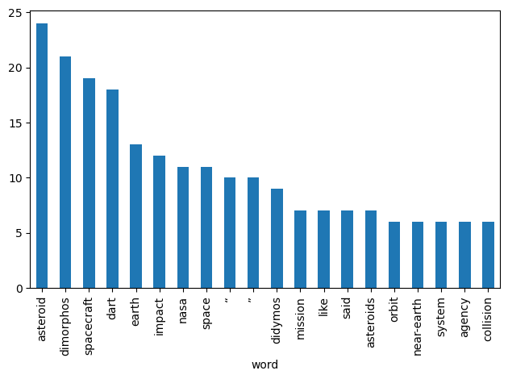
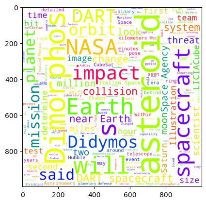

```python
#1
#Nathan Rosen NZR223
#BUAN 357
#Assignment 2 
```

Question 4
250 words and apa citation
Space travel has always been a topic of interest for me and it just so happened that an almost year long NASA mission had concluded on the same day that I started the assignment. Additionally, NLP is definitely a topic of interest for a company like NASA. Their space exploration projects are done primarily for the benefit of society, so it is important for them to analyze how the public is perceiving their projects and success and/or failures. I'm specifically interested in the sentiment analysis of this article in order to see if their dart mission is regarded as successful in the news. The sentiment analysis, as well as  the other variables that are assessed,  will help NASA choose their future missions carefully and give them metrics to compare future dart missions with.

https://www.cnn.com/2022/09/26/world/dart-mission-nasa-scn/index.html

Strickland, A. (2022, September 27). NASA's Dart Mission successfully slams into an asteroid. CNN. Retrieved September 29,  
    2022, from https://www.cnn.com/2022/09/26/world/dart-mission-nasa-scn/index.html 


```python
#Question 5
import requests
import pandas as pd
import matplotlib.pyplot as plt
from bs4 import BeautifulSoup
from pathlib import Path
from textblob import TextBlob
from textblob.sentiments import NaiveBayesAnalyzer
from operator import itemgetter
from wordcloud import WordCloud
from textatistic import Textatistic
```


```python
response = requests.get("https://www.cnn.com/2022/09/26/world/dart-mission-nasa-scn/index.html")
```


```python
soup = BeautifulSoup(response.content, "html5lib")
```


```python
text1 = soup.get_text(strip = True)
```


```python
text = Path('cnnNASA.txt').read_text()
```


```python
blob = TextBlob(text)
blob.sentiment
```


    Sentiment(polarity=0.1531136499159755, subjectivity=0.4670538763562018)


```python
#Question 6
for sentence in blob.sentences:
    print(sentence.sentiment)
```

    Sentiment(polarity=0.5, subjectivity=0.6416666666666666)
    Sentiment(polarity=0.0, subjectivity=0.0)
    Sentiment(polarity=0.0, subjectivity=0.0)
    Sentiment(polarity=0.0, subjectivity=0.0)
    Sentiment(polarity=0.0, subjectivity=0.125)
    Sentiment(polarity=0.03409090909090909, subjectivity=0.8136363636363636)
    Sentiment(polarity=0.6000000000000001, subjectivity=0.9)
    Sentiment(polarity=0.4, subjectivity=0.75)
    Sentiment(polarity=0.4, subjectivity=0.75)
    Sentiment(polarity=0.0, subjectivity=0.0)
    Sentiment(polarity=-0.1, subjectivity=0.1)
    Sentiment(polarity=0.0, subjectivity=0.0)
    Sentiment(polarity=-0.25, subjectivity=0.4)
    Sentiment(polarity=1.0, subjectivity=1.0)
    Sentiment(polarity=0.0, subjectivity=0.0)
    Sentiment(polarity=0.125, subjectivity=0.41666666666666663)
    Sentiment(polarity=0.25, subjectivity=0.3333333333333333)
    Sentiment(polarity=0.0, subjectivity=0.0)
    Sentiment(polarity=0.1375, subjectivity=0.4375)
    Sentiment(polarity=0.5, subjectivity=0.5)
    Sentiment(polarity=0.0, subjectivity=0.0)
    Sentiment(polarity=-0.1, subjectivity=0.4)
    Sentiment(polarity=0.2, subjectivity=0.6)
    Sentiment(polarity=0.1875, subjectivity=0.5)
    Sentiment(polarity=-0.4, subjectivity=0.7)
    Sentiment(polarity=0.0, subjectivity=0.0)
    Sentiment(polarity=0.325, subjectivity=0.43333333333333335)
    Sentiment(polarity=0.5, subjectivity=1.0)
    Sentiment(polarity=-0.1, subjectivity=0.36)
    Sentiment(polarity=-0.07692307692307693, subjectivity=0.2692307692307692)
    Sentiment(polarity=0.033333333333333326, subjectivity=0.39999999999999997)
    Sentiment(polarity=0.0, subjectivity=0.0)
    Sentiment(polarity=0.13333333333333333, subjectivity=0.2333333333333333)
    Sentiment(polarity=-0.4, subjectivity=0.7)
    Sentiment(polarity=0.0, subjectivity=0.0)
    Sentiment(polarity=0.13333333333333333, subjectivity=0.16666666666666666)
    Sentiment(polarity=0.0, subjectivity=0.0)
    Sentiment(polarity=0.0, subjectivity=0.5)
    Sentiment(polarity=0.0, subjectivity=0.0)
    Sentiment(polarity=0.20000000000000004, subjectivity=0.6666666666666666)
    Sentiment(polarity=0.0, subjectivity=0.0)
    Sentiment(polarity=0.0, subjectivity=0.0)
    Sentiment(polarity=0.8, subjectivity=0.75)
    Sentiment(polarity=0.24583333333333335, subjectivity=0.4291666666666667)
    Sentiment(polarity=0.0, subjectivity=0.0)
    Sentiment(polarity=0.2, subjectivity=0.2)
    Sentiment(polarity=0.475, subjectivity=0.575)
    Sentiment(polarity=0.0, subjectivity=0.5)
    Sentiment(polarity=0.3, subjectivity=0.6666666666666666)
    Sentiment(polarity=-0.1, subjectivity=0.4)
    Sentiment(polarity=0.0, subjectivity=0.0)
    Sentiment(polarity=0.0, subjectivity=0.5)
    Sentiment(polarity=0.1875, subjectivity=0.5)
    Sentiment(polarity=0.0, subjectivity=0.0)
    Sentiment(polarity=0.0, subjectivity=0.14285714285714285)
    Sentiment(polarity=0.3, subjectivity=0.45)
    Sentiment(polarity=0.19999999999999998, subjectivity=0.9666666666666667)


```python
#Question 7
blob = TextBlob(text, analyzer=NaiveBayesAnalyzer())
blob.sentiment
```


    Sentiment(classification='pos', p_pos=1.0, p_neg=5.03146146928877e-26)


```python
#Question #7
for sentence in blob.sentences:
    print (sentence.sentiment)
```

    Sentiment(classification='neg', p_pos=0.06561377811708688, p_neg=0.9343862218829105)
    Sentiment(classification='pos', p_pos=0.5656491293051132, p_neg=0.4343508706948875)
    Sentiment(classification='pos', p_pos=0.6033205275258872, p_neg=0.3966794724741142)
    Sentiment(classification='neg', p_pos=0.21281427713671391, p_neg=0.7871857228632858)
    Sentiment(classification='pos', p_pos=0.9278599716945451, p_neg=0.07214002830545585)
    Sentiment(classification='pos', p_pos=0.9384335843289443, p_neg=0.06156641567106056)
    Sentiment(classification='pos', p_pos=0.5838142987621215, p_neg=0.4161857012378786)
    Sentiment(classification='pos', p_pos=0.704125975198285, p_neg=0.2958740248017159)
    Sentiment(classification='pos', p_pos=0.6331508608229787, p_neg=0.36684913917702117)
    Sentiment(classification='pos', p_pos=0.5732568871947687, p_neg=0.4267431128052329)
    Sentiment(classification='neg', p_pos=0.2776707192511641, p_neg=0.7223292807488373)
    Sentiment(classification='pos', p_pos=0.6374829038153988, p_neg=0.3625170961846048)
    Sentiment(classification='neg', p_pos=0.39031576428148235, p_neg=0.6096842357185176)
    Sentiment(classification='pos', p_pos=0.8633046552827841, p_neg=0.13669534471721487)
    Sentiment(classification='neg', p_pos=0.4529629309638507, p_neg=0.5470370690361466)
    Sentiment(classification='pos', p_pos=0.785701096908961, p_neg=0.21429890309103766)
    Sentiment(classification='pos', p_pos=0.9969780538254817, p_neg=0.0030219461745113366)
    Sentiment(classification='pos', p_pos=0.8979258292277422, p_neg=0.10207417077225917)
    Sentiment(classification='pos', p_pos=0.8867999110121769, p_neg=0.11320008898782537)
    Sentiment(classification='pos', p_pos=0.7746950839026678, p_neg=0.2253049160973314)
    Sentiment(classification='pos', p_pos=0.8601222104144528, p_neg=0.1398777895855475)
    Sentiment(classification='pos', p_pos=0.5728162797843518, p_neg=0.4271837202156481)
    Sentiment(classification='pos', p_pos=0.9593293009268978, p_neg=0.04067069907310343)
    Sentiment(classification='pos', p_pos=0.9250879792304334, p_neg=0.07491202076956602)
    Sentiment(classification='neg', p_pos=0.36523020554824825, p_neg=0.6347697944517519)
    Sentiment(classification='pos', p_pos=0.6536767568717289, p_neg=0.3463232431282728)
    Sentiment(classification='pos', p_pos=0.5025033482480219, p_neg=0.49749665175197827)
    Sentiment(classification='pos', p_pos=0.5253148080533502, p_neg=0.47468519194665304)
    Sentiment(classification='neg', p_pos=0.34712570539074045, p_neg=0.6528742946092575)
    Sentiment(classification='neg', p_pos=0.08002069599336685, p_neg=0.9199793040066324)
    Sentiment(classification='pos', p_pos=0.7207824203748211, p_neg=0.2792175796251752)
    Sentiment(classification='neg', p_pos=0.4094492578087401, p_neg=0.5905507421912598)
    Sentiment(classification='pos', p_pos=0.8111432675944393, p_neg=0.18885673240555786)
    Sentiment(classification='pos', p_pos=0.638572643506039, p_neg=0.3614273564939608)
    Sentiment(classification='neg', p_pos=0.11682745063856255, p_neg=0.8831725493614385)
    Sentiment(classification='pos', p_pos=0.7276147302449165, p_neg=0.2723852697550853)
    Sentiment(classification='neg', p_pos=0.26961890840095565, p_neg=0.7303810915990462)
    Sentiment(classification='pos', p_pos=0.7695179560879084, p_neg=0.2304820439120904)
    Sentiment(classification='neg', p_pos=0.3896108762551647, p_neg=0.6103891237448351)
    Sentiment(classification='pos', p_pos=0.8331370178025559, p_neg=0.1668629821974458)
    Sentiment(classification='neg', p_pos=0.4500242421804347, p_neg=0.5499757578195648)
    Sentiment(classification='neg', p_pos=0.4500242421804347, p_neg=0.5499757578195648)
    Sentiment(classification='neg', p_pos=0.10319244922407783, p_neg=0.8968075507759221)
    Sentiment(classification='pos', p_pos=0.741085628220964, p_neg=0.25891437177904575)
    Sentiment(classification='neg', p_pos=0.13018472743383647, p_neg=0.869815272566163)
    Sentiment(classification='pos', p_pos=0.7404623406061518, p_neg=0.2595376593938476)
    Sentiment(classification='pos', p_pos=0.6205459749309047, p_neg=0.3794540250690999)
    Sentiment(classification='neg', p_pos=0.11622880090035252, p_neg=0.8837711990996449)
    Sentiment(classification='pos', p_pos=0.999987705839117, p_neg=1.2294160888329163e-05)
    Sentiment(classification='pos', p_pos=0.9489369116605777, p_neg=0.051063088339426334)
    Sentiment(classification='pos', p_pos=0.8156648511902904, p_neg=0.18433514880970844)
    Sentiment(classification='pos', p_pos=0.6154311585369807, p_neg=0.3845688414630189)
    Sentiment(classification='pos', p_pos=0.9048687369225732, p_neg=0.0951312630774258)
    Sentiment(classification='pos', p_pos=0.9656064685772426, p_neg=0.03439353142275937)
    Sentiment(classification='pos', p_pos=0.6558016967657229, p_neg=0.3441983032342783)
    Sentiment(classification='pos', p_pos=0.6555402646907361, p_neg=0.3444597353092657)
    Sentiment(classification='pos', p_pos=0.8578643237749273, p_neg=0.14213567622507034)


```python
#Question 8
import nltk
from nltk.corpus import stopwords
stops = stopwords.words("english")
items = blob.word_counts.items()
from textblob import TextBlob
blob = TextBlob(text)
items = [item for item in items if item[0] not in stops]
print(items)
```

    [('nasa', 11), ('’', 24), ('dart', 18), ('mission', 7), ('successfully', 1), ('slams', 1), ('asteroid', 24), ('ashley', 2), ('strickland', 2), ('cnn', 2), ('updated', 1), ('9:26', 1), ('pm', 1), ('edt', 1), ('mon', 1), ('september', 1), ('26', 1), ('2022', 1), ('—', 3), ('spacecraft', 19), ('intentionally', 1), ('slammed', 1), ('humanity', 1), ('first', 4), ('test', 4), ('planetary', 5), ('defense', 2), ('impact', 12), ('occurred', 2), ('7:14', 1), ('p.m', 1), ('et', 1), ('greeted', 1), ('cheers', 1), ('team', 4), ('laurel', 2), ('maryland', 2), ('double', 1), ('redirection', 1), ('launched', 1), ('10', 2), ('months', 2), ('ago', 2), ('dimorphos', 21), ('risk', 1), ('impacting', 1), ('earth', 13), ('demonstration', 2), ('could', 5), ('determine', 4), ('deflect', 1), ('space', 11), ('rocks', 2), ('pose', 2), ('threat', 5), ('future', 1), ('ad', 1), ('feedback', 1), ('“', 10), ('embarking', 1), ('new', 1), ('era', 3), ('humankind', 1), ('potentially', 1), ('capability', 2), ('protect', 2), ('something', 2), ('like', 7), ('dangerous', 1), ('hazardous', 1), ('”', 10), ('said', 7), ('lori', 1), ('glaze', 1), ('director', 1), ('science', 1), ('division', 1), ('amazing', 1), ('thing', 1), ('never', 1), ('detailed', 3), ('view', 3), ('seen', 3), ('seconds', 2), ('hit', 4), ('time', 3), ('didymos', 9), ('relatively', 1), ('close', 1), ('–', 4), ('within', 3), ('6.8', 1), ('million', 5), ('miles', 4), ('11', 3), ('kilometers', 3), ('estimates', 1), ('point', 1), ('55', 2), ('feet', 4), ('17', 1), ('meters', 4), ('away', 2), ('rock', 1), ('center', 1), ('goal', 1), ('addition', 1), ('affect', 1), ('motion', 1), ('members', 1), ('say', 1), ('take', 1), ('two', 5), ('scientists', 3), ('orbit', 6), ('changed', 2), ('small', 2), ('moonlet', 1), ('orbiting', 1), ('near-earth', 6), ('system', 6), ('poses', 1), ('officials', 1), ('making', 1), ('perfect', 1), ('target', 1), ('kinetic', 1), ('may', 3), ('needed', 1), ('ever', 2), ('track', 2), ('illustration', 4), ('italian', 5), ('agency', 6), ('liciacube', 4), ('prior', 1), ('binary', 3), ('visible', 1), ('crashes', 1), ('tiny', 2), ('event', 3), ('full-scale', 1), ('deflection', 2), ('technology', 1), ('planet', 5), ('measurably', 1), ('change', 5), ('celestial', 1), ('body', 1), ('universe', 1), ('robert', 1), ('braun', 1), ('head', 1), ('johns', 2), ('hopkins', 3), ('university', 2), ('applied', 3), ('physics', 3), ('laboratory', 2), ('exploration', 1), ('sector', 1), ('interactive', 1), ('one', 2), ('journey', 1), ('defenses', 1), ('objects', 2), ('asteroids', 7), ('comets', 1), ('orbits', 2), ('place', 1), ('30', 1), ('48.3', 1), ('detecting', 1), ('neos', 1), ('cause', 1), ('grave', 1), ('harm', 1), ('primary', 1), ('focus', 1), ('organizations', 1), ('around', 3), ('world', 2), ('collision', 6), ('course', 2), ('astronomers', 3), ('discovered', 1), ('decades', 1), ('means', 2), ('twin', 1), ('greek', 1), ('roughly', 1), ('2,560', 1), ('780', 1), ('across', 1), ('meanwhile', 1), ('525', 1), ('160', 1), ('diameter', 1), ('name', 1), ('forms', 1), ('images', 3), ('taken', 2), ('reconnaissance', 1), ('camera', 2), ('optical', 1), ('navigation', 1), ('helped', 1), ('autonomously', 1), ('guide', 1), ('encounter', 1), ('moon', 5), ('streamed', 2), ('back', 2), ('rate', 1), ('per', 3), ('second', 2), ('providing', 1), ('pretty', 1), ('stunning', 1), ('look', 2), ('nancy', 1), ('chabot', 3), ('scientist', 2), ('coordination', 1), ('lead', 1), ('behind', 3), ('next', 1), ('c', 1), ('ion', 1), ('engine', 1), ('collide', 2), ('expect', 1), ('accelerated', 1), ('13,421', 1), ('hour', 2), ('21,600', 1), ('collided', 1), ('also', 2), ('revealed', 1), ('looks', 4), ('adorable', 1), ('cute', 1), ('carolyn', 1), ('ernst', 1), ('draco', 1), ('instrument', 1), ('lab', 1), ('lot', 2), ('ways', 1), ('egg-shaped', 1), ('surface', 2), ('covered', 1), ('boulders', 1), ('looked', 1), ('similar', 1), ('bennu', 1), ('ryugu', 1), ('visited', 1), ('recent', 1), ('years', 3), ('suspect', 1), ('rubble', 1), ('pile', 1), ('made', 2), ('loosely', 1), ('bound', 2), ('02', 1), ('osiris', 1), ('rex', 1), ('tag', 1), ('fun-house', 1), ('pit', 1), ('plastic', 1), ('balls', 1), ('eager', 1), ('learn', 1), ('crater', 2), ('left', 1), ('estimate', 1), ('33', 1), ('65', 1), ('20', 2), ('size', 2), ('even', 1), ('shattered', 1), ('pieces', 1), ('recorded', 1), ('light', 1), ('cubesat', 3), ('imaging', 1), ('companion', 1), ('cube', 1), ('satellite', 1), ('provided', 1), ('briefcase-size', 1), ('deployed', 1), ('traveled', 1), ('record', 2), ('happens', 1), ('three', 1), ('minutes', 3), ('flew', 1), ('capture', 1), ('video', 1), ('imagery', 1), ('immediately', 1), ('available', 1), ('days', 1), ('weeks', 1), ('following', 1), ('protecting', 1), ('chosen', 1), ('relative', 1), ('100', 1), ('times', 1), ('smaller', 1), ('obliterate', 1), ('missed', 1), ('hitting', 1), ('would', 1), ('placed', 1), ('created', 1), ('another', 1), ('opportunity', 1), ('fast', 1), ('speed', 1), ('1', 1), ('sound', 1), ('orbital', 2), ('period', 2), ('shows', 2), ('steve', 1), ('gribben/johns', 1), ('apl/nasa', 1), ('sometimes', 1), ('describe', 1), ('running', 1), ('golf', 1), ('cart', 1), ('great', 1), ('pyramid', 1), ('really', 1), ('disruption', 1), ('nudge', 1), ('shift', 3), ('slightly', 1), ('make', 1), ('gravitationally', 1), ('path', 1), ('increase', 1), ('chances', 1), ('becoming', 1), ('completes', 1), ('every', 1), ('hours', 2), ('45', 1), ('follow-up', 1), ('observations', 1), ('much', 2), ('use', 1), ('ground-based', 1), ('telescopes', 2), ('observe', 1), ('see', 1), ('successful', 1), ('space-based', 1), ('hubble', 3), ('webb', 1), ('lucy', 1), ('observed', 2), ('latest', 1), ('saturn', 4), ('telescope', 1), ('captures', 1), ('exquisite', 1), ('details', 2), ('ring', 1), ('phonograph', 1), ('grooves', 1), ('represent', 1), ('structure', 1), ('rings', 2), ('atmospheric', 2), ('captured', 1), ('visiting', 1), ('distant', 1), ('wide', 1), ('field', 1), ('3', 1), ('june', 1), ('2019', 1), ('closest', 1), ('approach', 1), ('845', 1), ('image', 1), ('yearly', 1), ('series', 1), ('snapshots', 1), ('part', 1), ('outer', 1), ('planets', 2), ('atmospheres', 1), ('legacy', 1), ('opal', 2), ('project', 1), ('helping', 1), ('understand', 1), ('dynamics', 1), ('evolution', 1), ('solar', 1), ('gas', 1), ('giant', 1), ('case', 1), ('able', 1), ('shifting', 1), ('weather', 1), ('patterns', 1), ('changes', 1), ('identify', 1), ('trends', 1), ('long-lost', 1), ('explains', 1), ('origin', 1), ('signature', 1), ('four', 1), ('european', 1), ('arrive', 1), ('study', 1), ('probe', 1), ('measure', 1), ('physical', 1), ('properties', 1), ('currently', 1), ('direct', 1), ('27,000', 1), ('exist', 1), ('shapes', 1), ('sizes', 1), ('valuable', 1), ('data', 1), ('collected', 1), ('hera', 1), ('contribute', 1), ('strategies', 1), ('especially', 1), ('understanding', 1), ('kind', 1), ('force', 1), ('potential', 1)]


```python
sorted_items = sorted(items, key=itemgetter(1), reverse=True)
print(sorted_items)
```

    [('’', 24), ('asteroid', 24), ('dimorphos', 21), ('spacecraft', 19), ('dart', 18), ('earth', 13), ('impact', 12), ('nasa', 11), ('space', 11), ('“', 10), ('”', 10), ('didymos', 9), ('mission', 7), ('like', 7), ('said', 7), ('asteroids', 7), ('orbit', 6), ('near-earth', 6), ('system', 6), ('agency', 6), ('collision', 6), ('planetary', 5), ('could', 5), ('threat', 5), ('million', 5), ('two', 5), ('italian', 5), ('planet', 5), ('change', 5), ('moon', 5), ('first', 4), ('test', 4), ('team', 4), ('determine', 4), ('hit', 4), ('–', 4), ('miles', 4), ('feet', 4), ('meters', 4), ('illustration', 4), ('liciacube', 4), ('looks', 4), ('saturn', 4), ('—', 3), ('era', 3), ('detailed', 3), ('view', 3), ('seen', 3), ('time', 3), ('within', 3), ('11', 3), ('kilometers', 3), ('scientists', 3), ('may', 3), ('binary', 3), ('event', 3), ('hopkins', 3), ('applied', 3), ('physics', 3), ('around', 3), ('astronomers', 3), ('images', 3), ('per', 3), ('chabot', 3), ('behind', 3), ('years', 3), ('cubesat', 3), ('minutes', 3), ('shift', 3), ('hubble', 3), ('ashley', 2), ('strickland', 2), ('cnn', 2), ('defense', 2), ('occurred', 2), ('laurel', 2), ('maryland', 2), ('10', 2), ('months', 2), ('ago', 2), ('demonstration', 2), ('rocks', 2), ('pose', 2), ('capability', 2), ('protect', 2), ('something', 2), ('seconds', 2), ('55', 2), ('away', 2), ('changed', 2), ('small', 2), ('ever', 2), ('track', 2), ('tiny', 2), ('deflection', 2), ('johns', 2), ('university', 2), ('laboratory', 2), ('one', 2), ('objects', 2), ('orbits', 2), ('world', 2), ('course', 2), ('means', 2), ('taken', 2), ('camera', 2), ('streamed', 2), ('back', 2), ('second', 2), ('look', 2), ('scientist', 2), ('collide', 2), ('hour', 2), ('also', 2), ('lot', 2), ('surface', 2), ('made', 2), ('bound', 2), ('crater', 2), ('20', 2), ('size', 2), ('record', 2), ('orbital', 2), ('period', 2), ('shows', 2), ('hours', 2), ('much', 2), ('telescopes', 2), ('observed', 2), ('details', 2), ('rings', 2), ('atmospheric', 2), ('planets', 2), ('opal', 2), ('successfully', 1), ('slams', 1), ('updated', 1), ('9:26', 1), ('pm', 1), ('edt', 1), ('mon', 1), ('september', 1), ('26', 1), ('2022', 1), ('intentionally', 1), ('slammed', 1), ('humanity', 1), ('7:14', 1), ('p.m', 1), ('et', 1), ('greeted', 1), ('cheers', 1), ('double', 1), ('redirection', 1), ('launched', 1), ('risk', 1), ('impacting', 1), ('deflect', 1), ('future', 1), ('ad', 1), ('feedback', 1), ('embarking', 1), ('new', 1), ('humankind', 1), ('potentially', 1), ('dangerous', 1), ('hazardous', 1), ('lori', 1), ('glaze', 1), ('director', 1), ('science', 1), ('division', 1), ('amazing', 1), ('thing', 1), ('never', 1), ('relatively', 1), ('close', 1), ('6.8', 1), ('estimates', 1), ('point', 1), ('17', 1), ('rock', 1), ('center', 1), ('goal', 1), ('addition', 1), ('affect', 1), ('motion', 1), ('members', 1), ('say', 1), ('take', 1), ('moonlet', 1), ('orbiting', 1), ('poses', 1), ('officials', 1), ('making', 1), ('perfect', 1), ('target', 1), ('kinetic', 1), ('needed', 1), ('prior', 1), ('visible', 1), ('crashes', 1), ('full-scale', 1), ('technology', 1), ('measurably', 1), ('celestial', 1), ('body', 1), ('universe', 1), ('robert', 1), ('braun', 1), ('head', 1), ('exploration', 1), ('sector', 1), ('interactive', 1), ('journey', 1), ('defenses', 1), ('comets', 1), ('place', 1), ('30', 1), ('48.3', 1), ('detecting', 1), ('neos', 1), ('cause', 1), ('grave', 1), ('harm', 1), ('primary', 1), ('focus', 1), ('organizations', 1), ('discovered', 1), ('decades', 1), ('twin', 1), ('greek', 1), ('roughly', 1), ('2,560', 1), ('780', 1), ('across', 1), ('meanwhile', 1), ('525', 1), ('160', 1), ('diameter', 1), ('name', 1), ('forms', 1), ('reconnaissance', 1), ('optical', 1), ('navigation', 1), ('helped', 1), ('autonomously', 1), ('guide', 1), ('encounter', 1), ('rate', 1), ('providing', 1), ('pretty', 1), ('stunning', 1), ('nancy', 1), ('coordination', 1), ('lead', 1), ('next', 1), ('c', 1), ('ion', 1), ('engine', 1), ('expect', 1), ('accelerated', 1), ('13,421', 1), ('21,600', 1), ('collided', 1), ('revealed', 1), ('adorable', 1), ('cute', 1), ('carolyn', 1), ('ernst', 1), ('draco', 1), ('instrument', 1), ('lab', 1), ('ways', 1), ('egg-shaped', 1), ('covered', 1), ('boulders', 1), ('looked', 1), ('similar', 1), ('bennu', 1), ('ryugu', 1), ('visited', 1), ('recent', 1), ('suspect', 1), ('rubble', 1), ('pile', 1), ('loosely', 1), ('02', 1), ('osiris', 1), ('rex', 1), ('tag', 1), ('fun-house', 1), ('pit', 1), ('plastic', 1), ('balls', 1), ('eager', 1), ('learn', 1), ('left', 1), ('estimate', 1), ('33', 1), ('65', 1), ('even', 1), ('shattered', 1), ('pieces', 1), ('recorded', 1), ('light', 1), ('imaging', 1), ('companion', 1), ('cube', 1), ('satellite', 1), ('provided', 1), ('briefcase-size', 1), ('deployed', 1), ('traveled', 1), ('happens', 1), ('three', 1), ('flew', 1), ('capture', 1), ('video', 1), ('imagery', 1), ('immediately', 1), ('available', 1), ('days', 1), ('weeks', 1), ('following', 1), ('protecting', 1), ('chosen', 1), ('relative', 1), ('100', 1), ('times', 1), ('smaller', 1), ('obliterate', 1), ('missed', 1), ('hitting', 1), ('would', 1), ('placed', 1), ('created', 1), ('another', 1), ('opportunity', 1), ('fast', 1), ('speed', 1), ('1', 1), ('sound', 1), ('steve', 1), ('gribben/johns', 1), ('apl/nasa', 1), ('sometimes', 1), ('describe', 1), ('running', 1), ('golf', 1), ('cart', 1), ('great', 1), ('pyramid', 1), ('really', 1), ('disruption', 1), ('nudge', 1), ('slightly', 1), ('make', 1), ('gravitationally', 1), ('path', 1), ('increase', 1), ('chances', 1), ('becoming', 1), ('completes', 1), ('every', 1), ('45', 1), ('follow-up', 1), ('observations', 1), ('use', 1), ('ground-based', 1), ('observe', 1), ('see', 1), ('successful', 1), ('space-based', 1), ('webb', 1), ('lucy', 1), ('latest', 1), ('telescope', 1), ('captures', 1), ('exquisite', 1), ('ring', 1), ('phonograph', 1), ('grooves', 1), ('represent', 1), ('structure', 1), ('captured', 1), ('visiting', 1), ('distant', 1), ('wide', 1), ('field', 1), ('3', 1), ('june', 1), ('2019', 1), ('closest', 1), ('approach', 1), ('845', 1), ('image', 1), ('yearly', 1), ('series', 1), ('snapshots', 1), ('part', 1), ('outer', 1), ('atmospheres', 1), ('legacy', 1), ('project', 1), ('helping', 1), ('understand', 1), ('dynamics', 1), ('evolution', 1), ('solar', 1), ('gas', 1), ('giant', 1), ('case', 1), ('able', 1), ('shifting', 1), ('weather', 1), ('patterns', 1), ('changes', 1), ('identify', 1), ('trends', 1), ('long-lost', 1), ('explains', 1), ('origin', 1), ('signature', 1), ('four', 1), ('european', 1), ('arrive', 1), ('study', 1), ('probe', 1), ('measure', 1), ('physical', 1), ('properties', 1), ('currently', 1), ('direct', 1), ('27,000', 1), ('exist', 1), ('shapes', 1), ('sizes', 1), ('valuable', 1), ('data', 1), ('collected', 1), ('hera', 1), ('contribute', 1), ('strategies', 1), ('especially', 1), ('understanding', 1), ('kind', 1), ('force', 1), ('potential', 1)]


```python
top20 = sorted_items[1:21]
df_top20 = pd.DataFrame(top20, columns=['word', 'count'])

axes = df_top20.plot.bar(x='word', y='count', legend=False)

plt.gcf().tight_layout()

```


    

    


```python
#Question 11
wordcloud = WordCloud(width=1000, height=1000, 
    colormap='prism', background_color='white')
wordcloud = wordcloud.generate(text)
%matplotlib inline
import matplotlib.pyplot as plt
plt.imshow(wordcloud)
```


    <matplotlib.image.AxesImage at 0x7f8ae9cf9be0>


    

    


```python
#Question 12
readability = Textatistic(text)
%precision 3
readability.dict() 
```


    {'char_count': 6840,
     'word_count': 1329,
     'sent_count': 62,
     'sybl_count': 1900,
     'notdalechall_count': 472,
     'polysyblword_count': 146,
     'flesch_score': 64.130,
     'fleschkincaid_score': 9.640,
     'gunningfog_score': 12.968,
     'smog_score': 11.896,
     'dalechall_score': 10.308}


```python
#Question 12
readability.word_count / readability.sent_count
```


    21.435


#Question 13
Although NASA is a subdivision of the government, they are still a business and are always striving to be the most successful and generate the most revenue possible. As stated in question 4, NLP could be very useful for NASA to analyze how their projects are being perceived. It is important for NASA to know if their projects are supported by the public because they are generally working towards improving societal issues. One of the key metrics that NASA could use in their analysis would be the sensitivity analysis that was conducted on the entire article. Specifically, the polarity analysis of the article could give them good insight into the emotion that is contained within the CNN article. The polarity rating of 0.15 indicates that the article is generally pretty neutral, but leaning farther towards positive than negative. This would help NASA decide to continue with their DART missions and give them confidence that there is no negative sentiment regarding their missions. Another metric that NASA could use to improve future tests would be the top 20 word count. In addition to wanting to know the sentiment about their missions, NASA would also want to know if they are getting information to the public in an easy to understand way. The top 20 word count in this case reveals that CNN was focusing on information about the asteroid and technology, rather than explaining that the DART mission is meant to deflect incoming debris. This is an important piece of the mission and would suggest that NASA needs to do a better job with marketing their missions in the proper way. Both the sentiment and word_count analysis would provide valuable analysis to NASA to improve their future space exploration projects in the future. 

