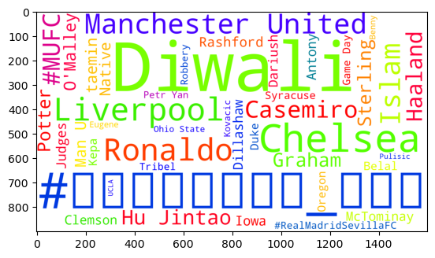

#Nathan Rosen NZR223@lehigh.edu
#BUAN 357
#Assignment 3 

A lot of the errors I was having seeemed to do with extracting the text from the tweets that are pulled. I thought I would be able to pull the text using the .data.text functions but kept getting errors when trying to do this. I'd be curious to know if you have any thoughts on why this might have occured.

#Infinity Ward Twitter @InfinityWard

Infinity Ward is a game developer firm which is best known for its contributions to the call of duty series. Next week they are planning to release their long awaited game Modern Warfare 2. I chose this company because it would be interesting to see how they have utilized their twitter account in the leadup to the release of the game. With more than 3 million followers, their twitter account can be a useful tool for generating interest and buzz. I am interested to see the sentiment of their recent tweets as well as the proportion of original vs retweeted tweets on their account. A lot of companies retweet positive tweets about their product leading up to an announcement or release and I am interested to see if Infinity Ward is utilizing a similar strategy. 


```python
#Excercise 13.4
import tweepy
import keys
client= tweepy.Client(bearer_token=keys.bearer_token,
                      wait_on_rate_limit= True)
infinity=(client.get_user(username = "InfinityWard",
                user_fields = ["description", "public_metrics"]))
infinity.data.id


```


    18742444


```python
infinity.data.name
```


```python
infinity.data.username
```


```python
infinity.data.description
```


```python
#Excercise 13.5
infinity_tweets= client.get_users_tweets(id=infinity.data.id,max_results =10)
for tweet in infinity_tweets.data:
    print(f"InfinityWard: {tweet.data['text']}\n")
```

    InfinityWard: RT @samuelroukin: Yes!! What a ride!! 💀💪🏼
    
    InfinityWard: RT @negusaurusrex: Had a blast for the #ModernWarfareII early access launch but missing the rest of the cast and the narrative team as well…
    
    InfinityWard: RT @MariaECamargo: Getting so much love for Valeria already!! GRACIAS CABRONES ❤️❤️❤️❤️✨ #MWII https://t.co/kxjaMg7RSo
    
    InfinityWard: You are the company you keep.
    
    #ModernWarfareII https://t.co/E9ISLxD24A
    
    InfinityWard: Check out this banger '141' by @BANDA_MS from #ModernWarfare2 https://t.co/PVcOyA24AL
    
    InfinityWard: IT'S TIME 🫡
    
    Campaign Early Access is live! Preorder to play it right now: https://t.co/R8O9rTyQWB https://t.co/v19I56eMGj
    
    InfinityWard: RT @CallofDuty: Will you become what you’re trying to destroy in order to defeat it? 💥
    
    #MWII Campaign Early Access is now available! Pre-o…
    
    InfinityWard: @CallofDuty https://t.co/LVPJtMfR3j
    
    InfinityWard: RT @negusaurusrex: In just a couple hours #ModernWarfareII will be playable. So much blood and sweat went into making this thing, tons of h…
    
    InfinityWard: Campaign Early Access starts tomorrow! So here’s 5 things you should know to get you hyped for the #ModernWarfare2 campaign 🫡 https://t.co/CWWzb6Pd8I
    


```python
#Exercise 13.2
infinity_tweets= client.get_users_tweets(id=infinity.data.id,max_results =100)

inifinity_tweets.data.text.count("RT")
infinity_tweets_counter = 0


## two different attempts at the answer. I wasnt sure why the error was occuring

for tweet in infinity_tweets.data.text.startswith('RT'):
    infinity_tweets_counter+=1
    
    
infinity_tweets_counter/100
    
    
        
    


```


    ---------------------------------------------------------------------------

    AttributeError                            Traceback (most recent call last)

    /var/folders/c2/m9k0t3cx7ll7gxptyf12gq680000gn/T/ipykernel_64202/2792353402.py in <module>
          2 infinity_tweets= client.get_users_tweets(id=infinity.data.id,max_results =100)
          3 
    ----> 4 infinity_tweets_data = infinity_tweets.text
          5 


    AttributeError: 'Response' object has no attribute 'text'


```python
#Excercise 13.6
tweets= client.search_recent_tweets(
    query = "😃",
    expansions= ["author_id"], tweet_fields = ["lang"])
print(tweets)
from textblob import TextBlob
import tweepy


blob = TextBlob(tweets.data.text)
if blob.sentiment.polarity > 0:
    sentiment = '+'
    self.sentiment_dict['positive'] += 1 
elif blob.sentiment.polarity == 0:
    sentiment = ' '
    self.sentiment_dict['neutral'] += 1 
else:
    sentiment = '-'
    self.sentiment_dict['negative'] += 1 
    


            

        


        
```

    Response(data=[<Tweet id=1583924376675618816 text='RT @Ayla07972269: "Amo la violencia con la que tu sonrisa destruye mi rutina."\n\nGabriel García Márquez😃 https://t.co/I4QzBxicP7'>, <Tweet id=1583924376009048064 text='@2727mmg2727 Karakter önemli abi. Karakter dağıtılırken bazıları ağzını açıyormuş😃'>, <Tweet id=1583924374574632961 text='RT @Nwokedi_Naz: @Papa28x4 @PeterObi You think he has any affection for you! Think again sir.\n\nHis own is the certificate after office...😃'>, <Tweet id=1583924373471514625 text='RT @EdegarPretto: Bagé, a Rainha da Fronteira arrasou na caminhada do mutirão vira voto @LulaOficial presidente! 😃 Lula foi gigante nos inv…'>, <Tweet id=1583924372640714752 text='@maid_utata うたたちゃん、10/22(Sat)は\n最後のお給仕(お仕事)だったね!お疲れ様😌💓でした。そして卒業おめでとう🎉あまり会えるチャンスとか少なく感じたけど元気でね😃✌️･･･\n和にゃんこと川口和明また何処かで会えたら宜しくね‼️･･･'>, <Tweet id=1583924372510679040 text='@tos\n\n#暇な人話そ #中性さんと繋がりたい\n\n🧡🌛😃'>, <Tweet id=1583924372313497600 text='@i0QPYDcJNJk7VIP おはようございます😃\n素敵な日曜日をお過ごしください😃☕\n今日も一日よろしくお願いします😊🙇🏻\u200d♂️☕️'>, <Tweet id=1583924369931530241 text='@Astromatikk Hadi inşallah 😃'>, <Tweet id=1583924368479899648 text='Camarão e suco de caju 😃'>, <Tweet id=1583924368014311427 text='@CawthornforNC Self sufficient people will save themselves. 👊🏽😃'>], includes={'users': [<User id=105276427 name=Sonia Varea username=soniavarea>, <User id=1488768203446702081 name=Nuri username=Nuri454638>, <User id=146653009 name=Eke username=Papa28x4>, <User id=236801589 name=Nivaldo Avelino Da Rosa Júnior username=guru_sc>, <User id=1507592508406083587 name=K.Kazuaki(和明) username=0X42l7eA6veCrxu>, <User id=1579043630320390147 name=りえ💫😌 username=Frances98834671>, <User id=766701468 name=なんちゃん@南部珈琲エスカード牛久店 username=Ynanbucoffee>, <User id=1322606113666289666 name=Nilüfer username=Nilfer77606879>, <User id=1249498831625940994 name=Bené, sport club derrota paulista username=_Benezin>, <User id=1382540443519373315 name=⚡️Danny.Xrp⚡️ username=daniel87885007>]}, errors=[], meta={'newest_id': '1583924376675618816', 'oldest_id': '1583924368014311427', 'result_count': 10, 'next_token': 'b26v89c19zqg8o3fpzekpqj4eqfibwu9v1qm34jtwwrjx'})


    ---------------------------------------------------------------------------

    AttributeError                            Traceback (most recent call last)

    /var/folders/c2/m9k0t3cx7ll7gxptyf12gq680000gn/T/ipykernel_64202/3246995487.py in <module>
          8 
          9 
    ---> 10 blob = TextBlob(tweets.data.text)
         11 if blob.sentiment.polarity > 0:
         12     sentiment = '+'


    AttributeError: 'list' object has no attribute 'text'


```python
#Excercise 13.8
from operator import itemgetter
auth = tweepy.OAuth2BearerHandler(keys.bearer_token)
api = tweepy.API(auth=auth,wait_on_rate_limit=True)
la_trends= api.get_place_trends(id=2442047)
la_list = la_trends[0]['trends']
la_list = [t for t in la_list if t['tweet_volume']]
la_list.sort(key =itemgetter('tweet_volume'), reverse = True)
for trend in la_list [:3]:
    print(trend['name'])

                             

```

    Diwali
    #지구에서년지성아_환영해
    Chelsea


```python
import pandas as pd
df = pd.DataFrame(la_list, columns=[trend['name'], trend['tweet_volme']])  

```


    ---------------------------------------------------------------------------

    KeyError                                  Traceback (most recent call last)

    /var/folders/c2/m9k0t3cx7ll7gxptyf12gq680000gn/T/ipykernel_64202/3039716881.py in <module>
          1 import pandas as pd
    ----> 2 df = pd.DataFrame(la_list, columns=[trend['name'], trend['tweet_volme']])
    

    KeyError: 'tweet_volme'


```python
%matplotlib inline
axes = df.plot.bar(x='name', y='tweet_volume', legend=False)

import matplotlib.pyplot as plt

plt.gcf().tight_layout()


```


```python
#Excercise 13.9
from operator import itemgetter

```


```python
auth = tweepy.OAuth2BearerHandler(keys.bearer_token)
api = tweepy.API(auth=auth,wait_on_rate_limit=True)
la_trends= api.get_place_trends(id=2442047)
la_list = la_trends[0]['trends']
la_list = [t for t in la_list if t['tweet_volume']]
la_list.sort(key =itemgetter('tweet_volume'), reverse = True)
for trend in la_list [:3]:
    print(trend['name'])
from textblob import TextBlob


```


```python
topics = {}
for trend in la_list:
    topics[trend['name']] = trend['tweet_volume']
    
from wordcloud import WordCloud
wordcloud= WordCloud(width=1600, height=900, prefer_horizontal =0.5, colormap = 'prism', background_color = 'white')
wordcloud = wordcloud.fit_words(topics)
import matplotlib.pyplot as plt
plt.imshow(wordcloud)
wordcloud = wordcloud.to_file(HW.png)


```


    ---------------------------------------------------------------------------

    NameError                                 Traceback (most recent call last)

    /var/folders/c2/m9k0t3cx7ll7gxptyf12gq680000gn/T/ipykernel_64202/3608493540.py in <module>
          8 import matplotlib.pyplot as plt
          9 plt.imshow(wordcloud)
    ---> 10 wordcloud = wordcloud.to_file(HW.png)
         11 


    NameError: name 'HW' is not defined


    

    


Conclusion:

I had a lot of errors when running through this assignment, so I was unable to get all of the data for the analysis. With that being said it is easy to see how this kind of analysis could be very beneficial for a company. Infinity Ward is the company I chose and they could use sentiment analysis to identify the emotion that they are conveying through their twitter account. Sometimes a tweet can convey an emotion or sentiment that is not intended and analysis like this could identify that. Additionally, the analysis could identify whether or not Infinity Ward needs to allocate more funding towards their marketing department. If the twitter account is having good engagement numbers and easily finding retweetable content, than Infinity ward will decide not to allocate more money towards marketing. If the results show the opposite, then Infinity Ward will know that they need to allocate more funding towards the marketing of their new game.


