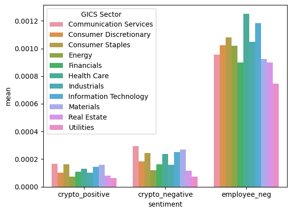
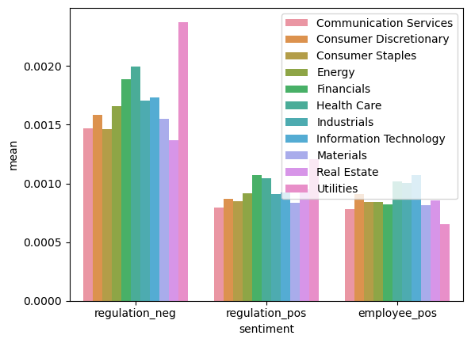
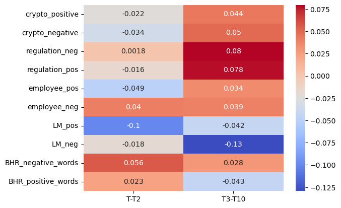
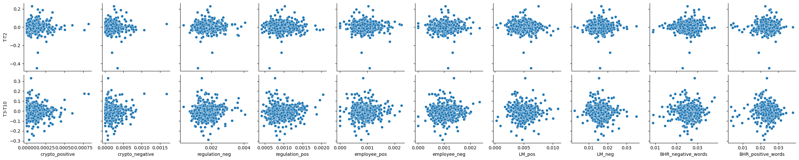
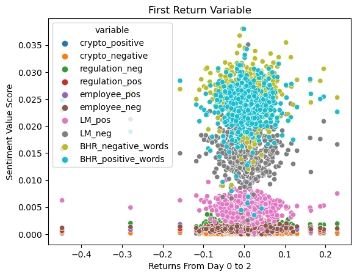
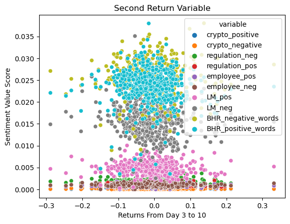

## Neccesary Imports:


```python
import fnmatch
import glob
import os
import re
from time import sleep
from zipfile import ZipFile
import numpy as np
import pandas as pd
from bs4 import BeautifulSoup
from near_regex import NEAR_regex  
from tqdm import tqdm
from io import BytesIO
from zipfile import ZipFile
from urllib.request import urlopen
import seaborn as sns
import matplotlib.pyplot as plt
import pandas_datareader as pdr
os.makedirs("output", exist_ok=True)
```

# 1. Summary

Summarize your question, what you did, and your findings. You can model this on the abstracts in the literature folder.

This project aims to tackle the question of whether the sentiment in a 10k statement impacts stocks returns in the days following the report. My hypothesis was that a higher sentiment score would lead to better returns and vice versa. This seemed like a common sense hypothesis due to the idea that positive would lead to more positive. After looking at the results it was clear that my hypothesis was incorrect. Many of the results were inconclusive due to contradicting reports in the correlation matrix. Some variables were positively affected by positive sentiment, but some were negatively affected by the same thing. One of the issues of my hypothesis was that I did not take into account two factors. One was the time frame of the report and two being the small scope of the data. The report is focused on 2022 returns and 10k releases. The sentiment analysis was done using two reputable sentiment dictionaries found in the inputs folder. Additionally, lists of words were compiled relating to three different topics that were used to analyze the sentiment of specific topics in a 10k. The three topics were intentionally very different in order to cast a wide net into analyzing a company's 10k text. 

# 2. The Data

The data consists of 503 firms that were a part of the S&P 500 index during the 2022 fiscal year. The list of firms that were used can be found here : [2022_S&P500]('https://en.wikipedia.org/wiki/List_of_S%26P_500_companies'). The list of companies was then used to download a 10k file for each individual firm using the SEC-Edgar database. After the 10k's were downloaded 10 sentiment variables were added to the data- 4 using the sentiment dictionary in the inputs folder and 6 using word lists that were created for 3 different topics. The topics consist of Cryptocurrency, Employee Syntax, and Regulations. The data also consists of two different return variables. One is the cumulative returns of the stock from the day of filing to two days later, and the other is 3 days after the filing date to 10 days after. The data can be found below and is initialized using the name sp500.


```python
sp500 =pd.read_csv('output/cleaned_sp500.csv')
sp500
```


<div>
<style scoped>
    .dataframe tbody tr th:only-of-type {
        vertical-align: middle;
    }

    .dataframe tbody tr th {
        vertical-align: top;
    }

    .dataframe thead th {
        text-align: right;
    }
</style>
<table border="1" class="dataframe">
  <thead>
    <tr style="text-align: right;">
      <th></th>
      <th>Symbol</th>
      <th>Security</th>
      <th>GICS Sector</th>
      <th>GICS Sub-Industry</th>
      <th>Headquarters Location</th>
      <th>Date added</th>
      <th>CIK</th>
      <th>Founded</th>
      <th>BHR_positive_words</th>
      <th>BHR_negative_words</th>
      <th>...</th>
      <th>mb</th>
      <th>prof_a</th>
      <th>ppe_a</th>
      <th>cash_a</th>
      <th>xrd_a</th>
      <th>dltt_a</th>
      <th>invopps_FG09</th>
      <th>sales_g</th>
      <th>dv_a</th>
      <th>short_debt</th>
    </tr>
  </thead>
  <tbody>
    <tr>
      <th>0</th>
      <td>MMM</td>
      <td>3M</td>
      <td>Industrials</td>
      <td>Industrial Conglomerates</td>
      <td>Saint Paul, Minnesota</td>
      <td>1957-03-04</td>
      <td>66740</td>
      <td>1902</td>
      <td>0.025683</td>
      <td>0.031662</td>
      <td>...</td>
      <td>2.838265</td>
      <td>0.197931</td>
      <td>0.218538</td>
      <td>0.101228</td>
      <td>0.042361</td>
      <td>0.355625</td>
      <td>2.564301</td>
      <td>0.098527</td>
      <td>0.072655</td>
      <td>0.086095</td>
    </tr>
    <tr>
      <th>1</th>
      <td>AOS</td>
      <td>A. O. Smith</td>
      <td>Industrials</td>
      <td>Building Products</td>
      <td>Milwaukee, Wisconsin</td>
      <td>2017-07-26</td>
      <td>91142</td>
      <td>1916</td>
      <td>0.024460</td>
      <td>0.023602</td>
      <td>...</td>
      <td>4.368153</td>
      <td>0.197847</td>
      <td>0.183974</td>
      <td>0.181729</td>
      <td>0.027113</td>
      <td>0.061075</td>
      <td>NaN</td>
      <td>0.222291</td>
      <td>0.048958</td>
      <td>0.080191</td>
    </tr>
    <tr>
      <th>2</th>
      <td>ABT</td>
      <td>Abbott</td>
      <td>Health Care</td>
      <td>Health Care Equipment</td>
      <td>North Chicago, Illinois</td>
      <td>1957-03-04</td>
      <td>1800</td>
      <td>1888</td>
      <td>0.021590</td>
      <td>0.024394</td>
      <td>...</td>
      <td>3.825614</td>
      <td>0.166285</td>
      <td>0.134475</td>
      <td>0.136297</td>
      <td>0.036465</td>
      <td>0.242726</td>
      <td>3.559664</td>
      <td>0.244654</td>
      <td>0.042582</td>
      <td>0.051893</td>
    </tr>
    <tr>
      <th>3</th>
      <td>ABBV</td>
      <td>AbbVie</td>
      <td>Health Care</td>
      <td>Pharmaceuticals</td>
      <td>North Chicago, Illinois</td>
      <td>2012-12-31</td>
      <td>1551152</td>
      <td>2013 (1888)</td>
      <td>0.019753</td>
      <td>0.022645</td>
      <td>...</td>
      <td>2.528878</td>
      <td>0.194433</td>
      <td>0.040074</td>
      <td>0.067086</td>
      <td>0.054911</td>
      <td>0.442929</td>
      <td>2.144449</td>
      <td>0.227438</td>
      <td>0.063203</td>
      <td>0.163364</td>
    </tr>
    <tr>
      <th>4</th>
      <td>ACN</td>
      <td>Accenture</td>
      <td>Information Technology</td>
      <td>IT Consulting &amp; Other Services</td>
      <td>Dublin, Ireland</td>
      <td>2011-07-06</td>
      <td>1467373</td>
      <td>1989</td>
      <td>0.027968</td>
      <td>0.023964</td>
      <td>...</td>
      <td>5.474851</td>
      <td>0.195625</td>
      <td>0.111674</td>
      <td>0.189283</td>
      <td>0.025902</td>
      <td>0.063702</td>
      <td>5.023477</td>
      <td>0.140013</td>
      <td>0.051790</td>
      <td>0.215661</td>
    </tr>
    <tr>
      <th>...</th>
      <td>...</td>
      <td>...</td>
      <td>...</td>
      <td>...</td>
      <td>...</td>
      <td>...</td>
      <td>...</td>
      <td>...</td>
      <td>...</td>
      <td>...</td>
      <td>...</td>
      <td>...</td>
      <td>...</td>
      <td>...</td>
      <td>...</td>
      <td>...</td>
      <td>...</td>
      <td>...</td>
      <td>...</td>
      <td>...</td>
      <td>...</td>
    </tr>
    <tr>
      <th>498</th>
      <td>YUM</td>
      <td>Yum! Brands</td>
      <td>Consumer Discretionary</td>
      <td>Restaurants</td>
      <td>Louisville, Kentucky</td>
      <td>1997-10-06</td>
      <td>1041061</td>
      <td>1997</td>
      <td>0.025014</td>
      <td>0.023482</td>
      <td>...</td>
      <td>9.129993</td>
      <td>0.395240</td>
      <td>0.337915</td>
      <td>0.123366</td>
      <td>0.000000</td>
      <td>1.019505</td>
      <td>8.944086</td>
      <td>0.164897</td>
      <td>0.099229</td>
      <td>0.012864</td>
    </tr>
    <tr>
      <th>499</th>
      <td>ZBRA</td>
      <td>Zebra Technologies</td>
      <td>Information Technology</td>
      <td>Electronic Equipment &amp; Instruments</td>
      <td>Lincolnshire, Illinois</td>
      <td>2019-12-23</td>
      <td>877212</td>
      <td>1969</td>
      <td>0.028396</td>
      <td>0.026842</td>
      <td>...</td>
      <td>5.635335</td>
      <td>0.192759</td>
      <td>0.064843</td>
      <td>0.055350</td>
      <td>0.091231</td>
      <td>0.167820</td>
      <td>5.301699</td>
      <td>0.265063</td>
      <td>0.000000</td>
      <td>0.089083</td>
    </tr>
    <tr>
      <th>500</th>
      <td>ZBH</td>
      <td>Zimmer Biomet</td>
      <td>Health Care</td>
      <td>Health Care Equipment</td>
      <td>Warsaw, Indiana</td>
      <td>2001-08-07</td>
      <td>1136869</td>
      <td>1927</td>
      <td>0.021506</td>
      <td>0.026759</td>
      <td>...</td>
      <td>1.592191</td>
      <td>0.092759</td>
      <td>0.097530</td>
      <td>0.020400</td>
      <td>0.021892</td>
      <td>0.242318</td>
      <td>1.415104</td>
      <td>0.115553</td>
      <td>0.008531</td>
      <td>0.227553</td>
    </tr>
    <tr>
      <th>501</th>
      <td>ZION</td>
      <td>Zions Bancorporation</td>
      <td>Financials</td>
      <td>Regional Banks</td>
      <td>Salt Lake City, Utah</td>
      <td>2001-06-22</td>
      <td>109380</td>
      <td>1873</td>
      <td>0.016075</td>
      <td>0.016980</td>
      <td>...</td>
      <td>NaN</td>
      <td>NaN</td>
      <td>NaN</td>
      <td>NaN</td>
      <td>NaN</td>
      <td>NaN</td>
      <td>NaN</td>
      <td>NaN</td>
      <td>NaN</td>
      <td>NaN</td>
    </tr>
    <tr>
      <th>502</th>
      <td>ZTS</td>
      <td>Zoetis</td>
      <td>Health Care</td>
      <td>Pharmaceuticals</td>
      <td>Parsippany, New Jersey</td>
      <td>2013-06-21</td>
      <td>1555280</td>
      <td>1952</td>
      <td>0.021790</td>
      <td>0.033508</td>
      <td>...</td>
      <td>8.969729</td>
      <td>0.236475</td>
      <td>0.187266</td>
      <td>0.250719</td>
      <td>0.036547</td>
      <td>0.485108</td>
      <td>8.792744</td>
      <td>0.164349</td>
      <td>0.034101</td>
      <td>0.006044</td>
    </tr>
  </tbody>
</table>
<p>503 rows × 90 columns</p>
</div>


- Creating Return Variables:

The challenge of creating the return variables was first finding the filing date of each 10k that was downloaded from SEC-Edgar. The filing dates could be found on a separate webpage on the SEC website. Each firm's specific webpage could be accessed only by using a specific CIK and accession number. The CIK numbers were already available in the initial dataset we downloaded from wikipedia, however the accession numbers needed to be scraped from the pathfiles of the 10k's we had downloaded. This was done using this code:

        accession_number = fpath.split('/')[-2]

Once the cik's and accession numbers had been found the filing dates could be found on the website using a web scraping technique. In this case, the method that was used was 
            
        filing_date = soup.find('div',text='Filing Date').find_next_sibling('div').text.strip()

All of this was done in a loop of the sp500 dataframe and each specific filing date that was pulled out was added to the dataframe. Once the filing dates were added another loop needed to be done in order to pull out the correct returns for each return variable. The returns were located in a different dataframe called sp_returns which had the returns for all stocks in the sp500. Using this information a loop was formed that did the following:
- looked through the sp_returns database and located the row where the firm and date in the loop were the same as the sp_returns database. This found us the index of the date where the 10k filing was.
- using the index that was pulled a list was created from the date of the filing to 2 indexes after and pulled the returns from those two days. 
- The returns were then added to 1, cumulated, and then the final row of the list was pulled out which was equal to the cumulative return for those three days.
- That variable was then added to a column in the data frame called 'T-T2'
- The same was done for each firm in the sp500 database
- The same process was done for the second variable, but the indexes were slightly adjusted in order to get day 3 to 10 rather than 0 to 2.


- Creating Sentiment Variables:

The 10 sentiment variables are split up into two categories: 4 that are taken straight from the LM and BHR dictionaries, and 6 that were created using word lists based upon topics.

 ## creating the first 4 variables
 In the input file, there are two dictionaries that contain positive and negative sentiment words. One of the dictionaries was compiled using a machine learning algorithm and the other was created by researchers. 
 
 The goal of each sentiment variable was to measure the percentage of words in a 10k that were either negative or positive. The first step was to split the dictionaries into positive and negative categories. This was done using columns in their dataframes called negative and positive. These values were used to load a negative and positive dictionary of each database. In order to do this the Near_regex function was necessary. This function takes an input and looks at how many times it is found in a specific document(in our case the 10k's). However, the function takes very specific input so after the dictionaries were loaded into their categories it was essential to put them in the proper format. This was done using this code:

            BHR_negative = ['('+'|'.join(BHR_negative)+')']
 
The same was done for each category which left us with four lists that were ready for analysis. 
A for loop was then created that looped through each firm, opened up the 10k that was downloaded, and pulled out just the text of that document. The code for that is here :
            
            html = report_file.read().decode(encoding="utf-8")
            soup = BeautifulSoup(html,features='lxml-xml')

            for div in soup.find_all("div", {'style':'display:none'}): 
                    div.decompose()
    
            lower = soup.get_text().lower()    
            no_punc = re.sub(r'\W',' ',lower)    
            cleaned = re.sub(r'\s+',' ',no_punc)

After the htmls were cleaned the last step was to use the near_regex function to check how many times each list category from before appeared in the 10k. The result of this was divided by the length of the html document and was added to the data frame

## creating the next 6 variables

The next 6 variables were meant to analyze specific topics in a 10k in order to get a good idea of a company's position in the three topics. The three topics that were chosen for this project were Cryptocurrency, Employees, and Regulations. This was done in order to give a broad scope of how a company was performing. The first step in creating these variables was compiling a list that was in depth enough that it would encompass all or most words related to the topic in the 10k. Preliminary word lists were done based on background knowledge and then further research was done on the internet in order to compile all the general words that related to a topic. Once the word lists were completed they had to be cleaned in the same way that the sentiment dictionaries had to be. Once that step was completed the near_regex function was needed once again in order to complete the task. The goal of the function in this stage was to check how many times a positive or negative word appeared next to one of the words in the word list all within each company's 10k. The near_regex function has a function called max_words_between which specifies how many words between the word list and sentiment dictionaries should the function check. I chose to use 4 for this project because that encompasses 8 words in between each other. A sentence could not confidently be distinguished as related to a topic if it was outside of that realm in my opinion. Similarly to the previous step once the near_regex function was used within the loop, the results were divided by the length of the 10k document and added to a column in the dataframe


# Data Exploration:

The final sample had 503 observations however some of them had missing data due to a 10k not being filed that year. This created huge problems in the analysis because if there was no 10k report then it would be impossible to conduct a sentiment analysis on the firm. Additionally, no filing date meant that it would be impossible to make return variables because there wouldn't be a day to start the index on. Because of this, I decided to eliminate any rows with missing values once the data was completed. This was done using these steps below:


```python
sp500[['Symbol','filing_date','crypto_positive', 'regulation_pos','T-T2','T3-T10']].isnull().sum()
```


    Symbol              0
    filing_date         8
    crypto_positive     8
    regulation_pos      8
    T-T2               13
    T3-T10             13
    dtype: int64


```python
sp500[['Symbol','filing_date','crypto_positive', 'regulation_pos','T-T2','T3-T10']].isnull().sum()
```


    Symbol              0
    filing_date         8
    crypto_positive     8
    regulation_pos      8
    T-T2               13
    T3-T10             13
    dtype: int64


I then decided to create a new dataframe called sp500_variables so that it would be easier to look at the new variables rather than a lot of the crsp variables that were created by someone else.


```python
sp500_variables = sp500[['Symbol','filing_date','crypto_positive', 'crypto_negative', 'regulation_neg', 'regulation_pos','T-T2','T3-T10', 'employee_pos','employee_neg','Length_10k', 'Unique_Words', 'LM_pos', 'LM_neg', 'BHR_negative_words', 'BHR_positive_words' ]]
```


```python
sp500_variables = sp500_variables.dropna()
```

Below is a .describe of all of the variables that were created in the making of this project. There are a couple of things to point out. 
- There are 490 observations in total
- Each of the sentiment and return variables has unique statistics which indicates that there is variation in the analysis variables


```python
sp500_variables.describe()
```


<div>
<style scoped>
    .dataframe tbody tr th:only-of-type {
        vertical-align: middle;
    }

    .dataframe tbody tr th {
        vertical-align: top;
    }

    .dataframe thead th {
        text-align: right;
    }
</style>
<table border="1" class="dataframe">
  <thead>
    <tr style="text-align: right;">
      <th></th>
      <th>crypto_positive</th>
      <th>crypto_negative</th>
      <th>regulation_neg</th>
      <th>regulation_pos</th>
      <th>T-T2</th>
      <th>T3-T10</th>
      <th>employee_pos</th>
      <th>employee_neg</th>
      <th>Length_10k</th>
      <th>Unique_Words</th>
      <th>LM_pos</th>
      <th>LM_neg</th>
      <th>BHR_negative_words</th>
      <th>BHR_positive_words</th>
    </tr>
  </thead>
  <tbody>
    <tr>
      <th>count</th>
      <td>490.000000</td>
      <td>490.000000</td>
      <td>490.000000</td>
      <td>490.000000</td>
      <td>490.000000</td>
      <td>490.000000</td>
      <td>490.000000</td>
      <td>490.000000</td>
      <td>490.000000</td>
      <td>490.000000</td>
      <td>490.000000</td>
      <td>490.000000</td>
      <td>490.000000</td>
      <td>490.000000</td>
    </tr>
    <tr>
      <th>mean</th>
      <td>0.000118</td>
      <td>0.000195</td>
      <td>0.001740</td>
      <td>0.000952</td>
      <td>0.004214</td>
      <td>-0.008591</td>
      <td>0.000913</td>
      <td>0.001038</td>
      <td>66430.616327</td>
      <td>5239.369388</td>
      <td>0.004931</td>
      <td>0.015810</td>
      <td>0.025509</td>
      <td>0.023539</td>
    </tr>
    <tr>
      <th>std</th>
      <td>0.000101</td>
      <td>0.000175</td>
      <td>0.000514</td>
      <td>0.000258</td>
      <td>0.051290</td>
      <td>0.065986</td>
      <td>0.000339</td>
      <td>0.000346</td>
      <td>29069.095629</td>
      <td>1253.462787</td>
      <td>0.001383</td>
      <td>0.003883</td>
      <td>0.003695</td>
      <td>0.004112</td>
    </tr>
    <tr>
      <th>min</th>
      <td>0.000000</td>
      <td>0.000000</td>
      <td>0.000296</td>
      <td>0.000411</td>
      <td>-0.447499</td>
      <td>-0.288483</td>
      <td>0.000000</td>
      <td>0.000000</td>
      <td>1574.000000</td>
      <td>460.000000</td>
      <td>0.000272</td>
      <td>0.002541</td>
      <td>0.008953</td>
      <td>0.003530</td>
    </tr>
    <tr>
      <th>25%</th>
      <td>0.000050</td>
      <td>0.000074</td>
      <td>0.001399</td>
      <td>0.000770</td>
      <td>-0.023486</td>
      <td>-0.048807</td>
      <td>0.000694</td>
      <td>0.000798</td>
      <td>48681.500000</td>
      <td>4651.250000</td>
      <td>0.004013</td>
      <td>0.013218</td>
      <td>0.023571</td>
      <td>0.021528</td>
    </tr>
    <tr>
      <th>50%</th>
      <td>0.000095</td>
      <td>0.000156</td>
      <td>0.001678</td>
      <td>0.000912</td>
      <td>0.002525</td>
      <td>-0.009534</td>
      <td>0.000890</td>
      <td>0.001020</td>
      <td>62751.500000</td>
      <td>5207.000000</td>
      <td>0.004860</td>
      <td>0.015555</td>
      <td>0.025761</td>
      <td>0.023910</td>
    </tr>
    <tr>
      <th>75%</th>
      <td>0.000151</td>
      <td>0.000268</td>
      <td>0.002039</td>
      <td>0.001104</td>
      <td>0.029887</td>
      <td>0.029470</td>
      <td>0.001102</td>
      <td>0.001261</td>
      <td>78689.000000</td>
      <td>5798.000000</td>
      <td>0.005646</td>
      <td>0.017884</td>
      <td>0.027656</td>
      <td>0.025958</td>
    </tr>
    <tr>
      <th>max</th>
      <td>0.000818</td>
      <td>0.001684</td>
      <td>0.004049</td>
      <td>0.002045</td>
      <td>0.229167</td>
      <td>0.332299</td>
      <td>0.002255</td>
      <td>0.002361</td>
      <td>271718.000000</td>
      <td>10238.000000</td>
      <td>0.010899</td>
      <td>0.035088</td>
      <td>0.038030</td>
      <td>0.037982</td>
    </tr>
  </tbody>
</table>
</div>


Another thing that was important to look at in the variables was whether or not the topic sentiments made sense based upon their industries. In order to look at this there were a couple of data cleaning steps necessary. Those can be seen below:


```python
industry_check = sp500[['crypto_positive', 'crypto_negative', 'employee_neg','GICS Sector', 'regulation_neg', 'regulation_pos',
             'employee_pos']]
grouped =industry_check.groupby('GICS Sector')[['crypto_positive', 'crypto_negative','employee_neg']].mean()
grouped = grouped.reset_index().melt(id_vars=['GICS Sector'], var_name='sentiment', value_name='mean')
sns.barplot(data=grouped, x='sentiment', y='mean', hue='GICS Sector')
```


    <AxesSubplot: xlabel='sentiment', ylabel='mean'>


    

    


```python
grouped =industry_check.groupby('GICS Sector')[['regulation_neg', 'regulation_pos','employee_pos']].mean()
grouped = grouped.reset_index().melt(id_vars=['GICS Sector'], var_name='sentiment', value_name='mean')
sns.barplot(data=grouped, x='sentiment', y='mean', hue='GICS Sector')
plt.legend(loc= 'upper right')

```


    <matplotlib.legend.Legend at 0x7f7f9af36280>


    

    


# Possible Issues with Dataset

One potential problem with the data set is that for some of the firms there was a miscalculation and we end up comparing the text of one firm's 10k to the returns of a completely different firm. This is known as mismeasuring X-values and can cause a lot of issues in analysis because it can create data that has no statistical significance. If this error is not caught then conclusions can be made based on false data and therefore the conclusions would be completely wrong. I was unable to decipher how often this problem was happening, but if I had more time I would dive deeper into the problem because if it is not just a one off issue then it makes the findings of the report insignificant. In terms of how this relates to the reported correlations, one of the issues would likely be insignificant and wouldn't skew the results too much. However, if this was a systematic issue then the correlations could be completely incorrect. It's difficult to say if this would make the correlations stronger or weaker without looking at specific data, however it's certain that it would affect the correlations incorrectly.

# Results

The most important metric when drawing conclusions from this report was the correlation matrix that I configured with the sentiment variables versus the two returns variables. I was slightly disappointed when I found the results of my matrix because it was difficult to find a concrete conclusion from the data I had. Many of the positive sentiment variables led to negative returns and vice versa. At first I thought this could be an issue with the topic sentiment variables I created and the word lists that I chose to use. However, after further analysis I found that even the LM and BHR dictionaries had contradicting results based on what you would expect. For example in the matrix below you can see that the BHR_negative words had a strong positive correlation with both return variables. However, this defeats common sense as you would expect a firm with a very negative 10k to have worse returns. It is possible that investors may see a 10k be negative and decide that it is a good time to buy low on the stock, however there is not enough data in this report to back up that hypothesis. 


```python
corr_matrix = sp500_variables.corr()

# Create correlation plot using Seaborn
sns.heatmap(corr_matrix.loc[['crypto_positive', 'crypto_negative', 'regulation_neg', 'regulation_pos', 'employee_pos','employee_neg' ,'LM_pos', 'LM_neg', 'BHR_negative_words', 'BHR_positive_words'], ['T-T2','T3-T10']], annot=True, cmap='coolwarm')
```


    <AxesSubplot: >


    

    


# Comparing the LM-Returns correlation to the ML-returns correlation

Looking at the above correlation matrix the main takeaway would be that the ML(BHR) sentiment variables both have a positive correlation with the first return variable, whereas the LM variables both have a negative relationship with the return variable. One thing that I found interesting was that for the LM sentiment variables the negative section had a significantly stronger correlation than the positive, but for the LM variables the opposite was true. 

## Comparing results with ML_JFE

The findings in my data contradict the findings from the ML_JFE report. In their report they state that the LM correlations are statistically insignificant, but the t-stat from the ML variables indicates some correlation between returns and sentiment. This finding does not replicate itself in my data as the strongest correlation of the four variables can be seen in the LM_positive variable with a value of 1. I have two suspicions for why my data could be different from the more robust report. The first reason would be that our study takes place during a covid year where stock returns were extremely volatile and hard to predict. This caused a lot of panic in the stock market and led to a lot of uncertainty and rash decisions from investors. The other suspicion I have is that our study only looks at 500 firms whereas I assume their studies look at thousands and thousands of stocks. Statistical significance is very difficult to prove in a report and it's possible that the small amount of data we are using was not enough to find the correct correlations. Their study also implemented a lot more control variables and more complex makeups which led to more precise results.

## Visualizing the data using scatterplots

Another way to visualize the results from the data would be by using scatterplots. Below is a compilation of all of the variables compared to their returns. 


```python
variables = sp500_variables[['crypto_positive', 'crypto_negative', 'regulation_neg', 'regulation_pos',
             'employee_pos', 'employee_neg', 'LM_pos',
             'LM_neg', 'BHR_negative_words', 'BHR_positive_words']]
y_variables = sp500_variables[['T-T2','T3-T10']]
sns.pairplot(sp500_variables, x_vars=variables, y_vars=y_variables)
```


    <seaborn.axisgrid.PairGrid at 0x7f7f9ad7e820>


    

    


Another way to look at the scatter plot data would be to compile a gigantic scatter plot that contains all of the variables within one graph. Below this is shown:


```python
variables1 =sp500_variables[['crypto_positive', 'crypto_negative', 'regulation_neg', 'regulation_pos',
             'employee_pos', 'employee_neg', 'LM_pos',
             'LM_neg', 'BHR_negative_words', 'BHR_positive_words', 'T-T2','T3-T10']]
long_data = variables1.melt(id_vars=['T-T2', 'T3-T10'])
long_data
sns.scatterplot(data= long_data, x='T-T2', y= 'value', hue= 'variable')
plt.xlabel('Returns From Day 0 to 2')
plt.ylabel('Sentiment Value Score')
plt.title('First Return Variable')
```


    Text(0.5, 1.0, 'First Return Variable')


    

    


```python
sns.scatterplot(data= long_data, x='T3-T10', y= 'value', hue= 'variable')
plt.xlabel('Returns From Day 3 to 10')
plt.ylabel('Sentiment Value Score')
plt.title('Second Return Variable')
```


    Text(0.5, 1.0, 'Second Return Variable')


    

    


# Are the sentiment topic variables significant?

Based on the above analysis it is hard to make a concrete answer to that question due to some of the inaccuracies in the results that have already been found. The correlation matrix does reveal some sort of a causal relationship between the topic variables I selected, however it's hard to identify if this has any real merit due to the contradictory results I found in the LM and ML correlations. I think that the topics due merit some further investigation, but it would be futile to continue with the analysis before identifying more problems with the initial data frame. This would allow you to optimize the data further which would make the correlation results have a lot more validity. 

The question of whether topic sentiment analysis in regards to returns has any merit is a resounding YES. Even though my report does not concretely support this answer, it's hard to deny the merit of looking at sentiment in regards to returns. Even if an investor is not reading through a company's 10k, the news outlets surely are and they will report what they find. If a 10k is overly positive, then the sentiment between investors will be that it is a good stock to buy and vice versa. Human's ability to interpret sentiment can be thought of as subconscious, so any study that attempts to bring that subconscious into concrete data certainly has merit and could give investors a huge leg up on the market. 

# ML Variables Sentiment Analysis

On (4) below: Focus on how the “ML sentiment” variables (positive and negative) are related to the two different return measures.

The relationship between the ML variables and the return variables is very odd. For starters the negative word section has a positive correlation with both of the return variables. This is extremely interesting because you would expect a high degree of negativity to correlate with negative returns. However these correlations indicate that the higher the use of negative words in a 10k the higher the returns and vice versa. When looking at the positive word sentiment the relationships are also odd. The two day return variable indicates a positive correlation which makes sense, but the 10 day variable indicates a negative relationship. My best guess as to why this occurs could be that investors see through the positive coating of a 10k and realize that it was all a smoking gun. This leads them to sell off their stocks leading to negative returns as the days pass after a 10k filing. The positive sentiment correlations at least make some semblance of sense, however I struggle to come up with a realistic reason for why the negative sentiment bins have positive correlations.


```python
corr_matrix = sp500_variables.corr()

# Create correlation plot using Seaborn
sns.heatmap(corr_matrix.loc[['crypto_positive', 'crypto_negative', 'regulation_neg', 'regulation_pos', 'employee_pos','employee_neg' ,'LM_pos', 'LM_neg', 'BHR_negative_words', 'BHR_positive_words'], ['T-T2','T3-T10']], annot=True, cmap='coolwarm')
```


    <AxesSubplot: >


    

    

